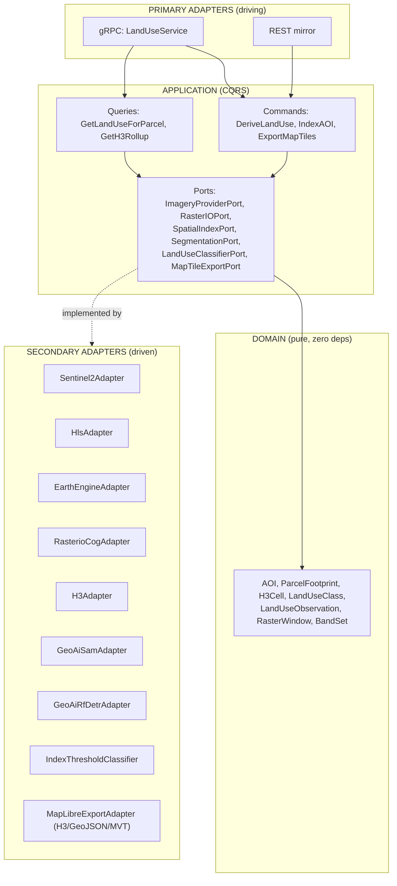

# ADR — geospatial-core architecture: imagery, H3, segmentation, COG tiling, map-render contract

**Date:** 2026-06-01
**Domain:** `geospatial-core`
**Decision:** Hexagonal (Explicit Architecture) Python service that derives
land-use/land-cover from Sentinel-2 + HLS rasters, aggregates onto H3, and exports an
H3/GeoJSON contract rendered in HabitaNexus via `flutter_maplibre_gl` + `h3_flutter`.
**Stack peer:** mirrors `services/agentic-core/` (hexagonal `src/`, ports/adapters,
proto-first gRPC+REST, polyglot-Turbo passthrough, BUSL-1.1).

---

## 1. Architecture — hexagonal, ports & adapters

All arrows point inward; infrastructure (imagery providers, rasterio, H3, models,
map exporters) depends on **domain-defined ports**, never the reverse — same
discipline as agentic-core.



**Ports (the contract surface):**

| Port | Responsibility | Fase-1 adapter(s) |
|---|---|---|
| `ImageryProviderPort` | Discover + fetch scenes/assets for an AOI + time window | `Sentinel2Adapter`, `HlsAdapter`, `EarthEngineAdapter` |
| `RasterIOPort` | Windowed COG reads, reprojection, tiling, band math | `RasterioCogAdapter` (rasterio/GDAL) |
| `SpatialIndexPort` | latLng→cell, cell→boundary, polyfill, compact, parent/child, k-ring | `H3Adapter` (h3-py) |
| `SegmentationPort` | Mask/instance segmentation of a raster window | `GeoAiSamAdapter`, `GeoAiRfDetrAdapter` |
| `LandUseClassifierPort` | Per-pixel/per-segment land-use class | `IndexThresholdClassifier` (NDVI/NDWI/NDBI + weak labels) |
| `MapTileExportPort` | Emit the render payload (H3 cells, GeoJSON, MVT/COG) | `MapLibreExportAdapter` |

This keeps every external dependency (rasterio, h3, opengeoai, GEE, MapLibre) swappable
and the domain pure — exactly the property agentic-core relies on for testability.

## 2. Sentinel-2 vs HLS — when to use each

Authoritative figures (HLS User Guide V2.0, NASA/USGS, Apr 2026; Copernicus Sentinel-2):

| Property | **Sentinel-2 (L2A SR)** | **HLS (S30 + L30)** |
|---|---|---|
| Native resolution | **10 m** (visible+NIR), 20 m red-edge/SWIR, 60 m atmos | **30 m** (all bands resampled) |
| Revisit | **5 days** (S2A+S2B/C combined) | **~2–3 days** (Landsat 8/9 **+** Sentinel-2 harmonized; **1.6 days avg** per User Guide) |
| Bands | 13 MSI | S30: 13 (MSI-derived); L30: 11 (OLI+TIRS) |
| Correction | L2A: Sen2Cor SR | LaSRC SR + Fmask QA + **NBAR (BRDF)** + bandpass-adjusted to OLI |
| Cross-sensor consistency | Single sensor | **Harmonized** — S30 & L30 are interoperable as one "data cube" |
| Tiling / projection | MGRS 110 km, UTM | MGRS 110 km, UTM, **COG** files |
| Cost | Free/open (Copernicus) | Free/open (NASA LP DAAC) |

**Verdict:**
- **Default to Sentinel-2 L2A for parcel-level land-use** — at parcel scale (a lot is
  often < 0.2 ha) the **10 m** detail is decisive. Digifarm's whole thesis is that raw
  Sentinel-2 is *too coarse* below ~2 ha and they super-resolve it; we do not need
  super-resolution for *class* labels (built/veg/soil/water), but we do need 10 m, so
  HLS's 30 m is the floor, not the ceiling.
- **Use HLS for time-series / change detection and cloud resilience** — when UC-4
  needs a clean dated snapshot or UC-3 needs trend over a municipality, HLS's harmonized
  **~2–3-day** cadence and Fmask QA give more cloud-free looks and a single consistent
  series across Landsat+Sentinel. The 30 m is acceptable for zone-level land use.
- **Earth Engine is a broker, not a hard dependency** — `EarthEngineAdapter` is the
  fast path to both `COPERNICUS/S2_SR_HARMONIZED` and `NASA/HLS/HLSS30_v002` +
  `HLSL30_v002`, plus weak-label sources (`ESA/WorldCover`, `GOOGLE/.../DYNAMICWORLD`,
  USDA CDL). Direct Copernicus/LP-DAAC COG access is the fallback so we are not locked
  to GEE quotas. SAT-RAKSHAK validates the FastAPI+GEE pattern.

**Rule of thumb encoded in `ImageryProviderPort` selection:** AOI ≤ ~5 ha and a single
recent date → Sentinel-2; AOI municipal-scale or needs a multi-date clean composite →
HLS.

## 3. H3 resolution choice for parcel-level land-use aggregation

H3 (Uber) — each finer resolution has **1/7** the area of the coarser one; 16 levels.
Average cell areas (h3geo docs):

| H3 res | Avg cell area | Avg edge | Fit for HabitaNexus |
|---|---|---|---|
| 8 | ~0.74 km² | ~461 m | District/zone rollups (B2G dashboard heatmap, UC-3) |
| 9 | ~0.105 km² (~10.5 ha) | ~174 m | Neighborhood |
| **10** | **~15,000 m² (~1.5 ha)** | **~65 m** | **Parcel-cluster default** |
| **11** | **~2,150 m² (~0.22 ha)** | **~24.6 m** | **Parcel-interior detail (built vs. open)** |
| 12 | ~307 m² | ~9.3 m | Sub-parcel, but below Sentinel-2 10 m pixel — over-resolved |

**Verdict:** aggregate at **res 11** for parcel-interior land-use (≈ 0.22 ha cell ≈ a
few Sentinel-2 10 m pixels — the natural quantum) and **roll up to res 10** for the
parcel-cluster summary returned in UC-1/UC-2; **res 8** for the municipal heatmap
(UC-3). Going below res 11 (e.g. 12) over-resolves relative to the 10 m source pixel
and inflates payload for no information gain. H3 IDs at res 10/11 are the **stable join
key** between server aggregation and the client overlay.

## 4. Segmentation model for satellite rasters — SAM vs RF-DETR vs classic LULC

opengeoai / **GeoAI** (`opengeos/geoai`, MIT) wraps all three on georeferenced rasters
(tiled inference on GeoTIFF, georeferenced GeoJSON/Shapefile/GeoParquet output).

| Approach | What it gives | Strengths | Weaknesses | Fit |
|---|---|---|---|---|
| **SAM / SamGeo** (incl. text-prompt GroundedSAM+CLIP) | Class-agnostic masks; zero-shot; prompt or auto | No training; crisp boundaries; great for **footprint extraction** (built area, water body, parcel object) | Class-agnostic — needs a labeller to name masks; heavier | **Footprint / object extraction** (UC-1 built-area, UC-4 snapshot) |
| **RF-DETR** (Roboflow, DINOv2+DETR; 5 detect + 6 seg variants) | Boxes / instance masks of **named** objects; real-time; tiled GeoTIFF; HF Hub | Fast; trainable; instance-level (count buildings/pools) | Needs labelled classes; detection not wall-to-wall LULC | **Instance objects** (structures, pools — feeds built-area + amenities) |
| **Classic LULC classifier** (NDVI/NDWI/NDBI thresholds + supervised RF, weak-labelled from ESA WorldCover / Dynamic World / USDA CDL) | Wall-to-wall **per-pixel land-use class** | Cheap; explainable; full coverage; weak labels are free & global | Coarser boundaries; threshold tuning per region (cf. the GEE NDVI>0.5 + soil-moisture demo, YouTube `j8ZREaT5Rg0`) | **Base land-use layer** (every UC) |

**Verdict — hybrid, classifier-first:**
1. **`LandUseClassifierPort` (index-threshold + weak-labelled RF) produces the
   wall-to-wall land-use base layer.** This is what UC-1…UC-5 fundamentally need (a
   *class per area*), it is cheap, explainable, and bootstrapped from free global labels
   (USDA CDL is decision-tree/RF trained on FSA Common Land Units at 30/10 m, 75–82%
   accuracy — a proven recipe; ESA WorldCover 10 m / Dynamic World give 11-class global
   labels in GEE).
2. **SAM refines built/water *footprints*** where crisp boundaries matter (built-area m²
   for the canon-cap prior UC-2; the dated snapshot UC-4).
3. **RF-DETR counts discrete structures/amenities** (buildings, pools) feeding built-area
   and HabitaNexus amenity tags.

Rationale: a pure SAM/RF-DETR approach is class-agnostic or detection-only and would
still need a classifier to *name* land use; the classifier alone is coarse at object
edges. The hybrid gives wall-to-wall classes cheaply, sharpened only where it pays.
Deep super-resolution (Digifarm-style) is **deferred** — it needs HPC and labelled data
we don't have in Fase 1.

## 5. Raster tiling / COG strategy with rasterio

- **COG everywhere.** HLS V2.0 ships as Cloud-Optimized GeoTIFF; we keep all derived
  products (land-use raster, masks) as COG so the API and the map layer can do
  **HTTP range / windowed reads** without downloading whole scenes.
- **`RasterioCogAdapter` does windowed reads** (`rasterio.windows.Window`) over the AOI
  bbox + a buffer, reads only the bands the classifier needs (B02/B03/B04/B08 for
  NDVI/NDWI/NDBI), and never materializes the full MGRS tile.
- **Tiling for inference:** GeoAI's tiled GeoTIFF inference (256/512 px tiles with
  overlap) feeds SAM/RF-DETR; results are stitched and georeferenced back via the COG
  transform.
- **Reprojection:** scenes arrive UTM/MGRS; for Costa Rica B2G output we reproject to
  **CRTM05 (EPSG:5367)** to align with the municipal `08USO_TIERRA_POR_ZONAS`
  FeatureServer (per `municipal-dashboard`). Internal H3 work stays in WGS84 (lat/lng),
  which H3 requires.
- **QA masking:** apply the HLS/Fmask QA band (cloud/shadow/water/snow bits) before
  classification so cloudy pixels don't contaminate land-use.
- **Overview pyramids** are built on derived COGs so MapLibre can request the right zoom
  level.

## 6. Map-render contract — `flutter_maplibre_gl` + `h3_flutter` (server ↔ client)

**H3 lives on BOTH sides.** The server (geospatial-core, via `SpatialIndexPort`)
**indexes and aggregates** onto H3 and emits **cell IDs + data only**; the Flutter
client (HabitaNexus) uses **`h3_flutter`** (pub.dev; Dart FFI/JS bindings to Uber H3,
Apache-2.0, Android/iOS/Linux/macOS/web/Windows) to **resolve each H3 cell ID to its
polygon boundary client-side** (`h3ToGeoBoundary`/`cellToBoundary`), then
**`flutter_maplibre_gl`** renders those polygons as a fill/line overlay over the basemap.

**Why split it this way:** the server never ships hexagon geometry — only compact
**64-bit H3 IDs + the land-use payload**. The client reconstructs geometry locally with
`h3_flutter`, so the payload stays tiny, the IDs are a stable join key, and the client
can re-tessellate / change resolution (parent/child via `h3ToParent`) without a
round-trip. This is the documented `h3_flutter` use case (client-side hexagon overlay
for a map) and mirrors how Uber uses H3.

`MapTileExportPort` emits three coordinated representations:

1. **H3 cell payload (primary, default)** — what the Flutter overlay consumes:
   ```jsonc
   {
     "schema": "geospatial-core/landuse-h3/v1",
     "resolution": 11,                 // H3 res; client may h3ToParent() to 10
     "crs": "EPSG:4326",              // H3 is WGS84; client reprojects if needed
     "observed_at": "2026-05-20T00:00:00Z",
     "source": { "provider": "sentinel-2", "scene": "T16PHV_20260520" },
     "cells": [
       { "h3": "8b2a1072d2dffff", "class": "built",      "confidence": 0.91, "area_m2": 2150 },
       { "h3": "8b2a1072d2c1fff", "class": "vegetation", "confidence": 0.86, "ndvi": 0.62 }
     ]
   }
   ```
   Client: `h3_flutter` → `cellToBoundary(h3)` → `Fill`/`Line` layer in
   `flutter_maplibre_gl`, colored by `class`.

2. **GeoJSON FeatureCollection** — dissolved per-class polygons (for non-H3 consumers,
   the B2G dashboard overlay, and export to the municipal `EPSG:5367` layer). Same
   `class`/`confidence` properties.

3. **MVT vector tiles / COG** — for large AOIs (UC-3 municipal scale) the export is a
   tiled source MapLibre streams by zoom, instead of a giant cell array.

**Contract guarantees:** stable H3 IDs at res 10/11; an enumerated `LandUseClass`
vocabulary (`built`, `bare_soil`, `vegetation`, `water`, `road`, `unknown`) shared
across all three representations and the proto enum; every payload carries
`observed_at` + `source` for the immutable dated-snapshot use case (UC-4).

## 7. Shared segmentation contract with vision-core (flagged, NOT built)

`vision-core` (sibling, parallel scaffold) does **close-range** crop/plant segmentation;
geospatial-core does **satellite/aerial** segmentation. Both ultimately return
"segments with a class + confidence + geometry." A future
`packages/common/segmentation/` contract (a shared proto `Segment`/`SegmentationResult`
message + a `LandUseClass`/`SpeciesClass` discriminated union) would let the two services
interoperate (e.g. AgTech UC-5: geospatial NDVI context hands off to vision-core
close-range). **This ADR only flags it** — per the brief and `openspec/project.md`'s
`packages/common` ownership, building it is a separate cross-domain change owned with
`vision-core`. Do not build in this change.

## 8. Alternatives considered (summary)

- **GEE-only (no direct COG access)** — rejected as sole path: quota/lock-in; kept as the
  preferred *broker* with a rasterio/COG fallback.
- **Square/quadkey tiles instead of H3** — rejected: H3's uniform single neighbor
  distance and 1/7 hierarchy fit aggregation + the `h3_flutter` client story; quadkeys
  don't have a first-class Flutter overlay binding.
- **Server-side hexagon geometry in the payload** — rejected: bloats payload; `h3_flutter`
  reconstructs it client-side for free.
- **Pure deep-learning LULC (no thresholds)** — deferred: needs HPC + regional labels
  (Digifarm scale); index-threshold + weak-labelled RF is the pragmatic Fase-1 base.

## 9. Owner decisions

**Resolved (2026-06-01):**
- ✅ **UC-2 legal framing → ADVISORY, no legal value.** The satellite built-area
  estimate is delivered strictly as an advisory input; it does **not** substitute the
  official avalúo catastral nor imply a legal valuation, and must not be presented as
  binding for the canon cap. Implementations of UC-2 must label outputs accordingly.
- ✅ **Domain row + label** added to `openspec/project.md`; `geospatial-core` and
  `vision-core` landed in the **same merge wave**.

**Still open (decide before implementation):**
1. **Provider priority:** GEE-broker-first vs. direct Copernicus/LP-DAAC COG-first as the
   *default* `ImageryProviderPort`? (Affects credentials + quota posture.)
2. **Shared `packages/common` segmentation contract** — green-light a joint
   geospatial-core × vision-core change to author it?
