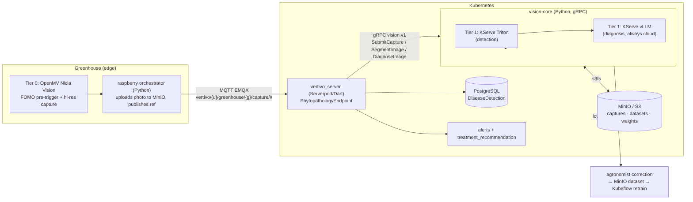

# ADR — vision-core architecture: hexagonal phytopathology MLOps engine, 3-tier phased topology, KServe Triton+vLLM, Kubeflow/s3fs, HITL, vertivo_server contract

**Date:** 2026-06-01 (MLOps architecture update: 2026-06-01)
**Domain:** `vision-core`
**Decision:** Hexagonal (Explicit Architecture) Python service for **phytopathology
in autonomous indoor hydroponic greenhouses (vertivolatam)**, delivered as a
**3-tier phased MLOps topology**:

- **Tier 0 (now):** on-camera **OpenMV Nicla Vision** FOMO pre-trigger + high-res
  capture — sidesteps Jetson Orin scarcity.
- **Tier 1 (Phase 1, cloud, authoritative):** KServe with **two** InferenceServices
  — **Triton** (YOLO26/RF-DETR detection) **+ vLLM** (VLM diagnosis). VLM is
  **always cloud**. HITL/active-learning retraining lives here.
- **Tier 2 (Phase 2, edge):** Jetson Orin runs lightweight detection in-greenhouse
  once models converge and Jetson supply recovers; **VLM stays cloud**. RF-DETR
  (Apache-2.0) is the recommended shipped edge default.

Ports: `SegmentationModelPort`, `VideoStreamPort`, `InferencePort`,
`ModelRegistryPort` (original) **+ `ObjectStoragePort` (s3fs/MinIO),
`DetectionRuntimePort` (Triton/KServe), `VlmDiagnosisPort` (vLLM/KServe),
`CaptureIngestPort` (Raspberry orchestrator), `ActiveLearningPort` (HITL)**.
MLOps stack: Kubeflow KFP (Dask → Katib → Training Operator/PyTorchJob DDP →
KServe), all data via **s3fs/MinIO** (the KFP-artifact workaround). gRPC `vision.v1`
contract consumed by **`vertivo_server`** (Serverpod/Dart).

> Research sources digested before this ADR are cited inline as `[Sn]` and listed
> in §9.

---

## 1. Architecture — Explicit Architecture (Hexagonal + DDD), mirroring agentic-core

vision-core copies `agentic-core`'s layering exactly so the monorepo stays
consistent: **all arrows point inward**; domain has zero external imports;
application defines port ABCs; adapters implement them.

```
Primary Adapters (gRPC, REST/FastAPI)   — call into →
  Application Layer (Commands, Queries, Ports)   — uses →
    Domain Layer (Image, Frame, Segmentation, Mask, CropLabel — pure)
  Application Layer   ← implemented by —
Secondary Adapters (UltralyticsYOLO, RF-DETR, ModelRegistry, VideoStream, OTel)
```

### Domain (pure, zero deps)
- **Entities:** `SegmentationJob` (a unit of work over an image or video),
  `ModelDescriptor` (id, family, task, version, crop scope).
- **Value objects:** `Image`, `VideoFrame`, `Mask` (polygon/RLE + class + score),
  `Segmentation` (the result: list of masks + image dims + model version +
  derived `affected_area_percent`), `CropLabel`, `BoundingBox`, `Confidence`,
  `Severity`.
- **Events:** `SegmentationCompleted`, `LowConfidenceFlagged`,
  `ModelVersionPromoted`.
- **Domain services:** `AreaQuantifier` (mask pixels → `affected_area_percent`),
  `SeverityScorer` (area + class → `severity` bucket). These are the pure
  functions Vertivo cannot get from classification/detection.

### Application — the four ports (the heart of the ADR)

| Port | Role | Driven adapter(s) |
|---|---|---|
| **`SegmentationModelPort`** | *Driven.* Given an `Image`/`VideoFrame` + `ModelDescriptor`, return a `Segmentation` (masks, labels, scores). The model-family abstraction. | `UltralyticsYOLOAdapter`, `RFDETRAdapter` |
| **`InferencePort`** | *Driven.* Where/how inference runs — local in-process (Jetson/cuDNN/TensorRT), or remote (KServe/Triton in-cluster). Decouples *which model* from *where it executes*. | `LocalTensorRTAdapter` (Jetson), `KServeInferenceAdapter` (cloud) |
| **`VideoStreamPort`** | *Driven.* Open a stream (RTSP/file/device), yield decoded `VideoFrame`s, handle frame sampling/backpressure for real-time vs batch. | `OpenCVVideoStreamAdapter`, `GStreamerJetsonAdapter` |
| **`ModelRegistryPort`** | *Driven.* Resolve/pull/promote model versions per crop; record `aiModelVersion`. Backs reproducible retraining + edge model sync. | `KubeflowModelRegistryAdapter`, `LocalFsModelRegistryAdapter` |
| **`ObjectStoragePort`** | *Driven.* MinIO/S3 via **s3fs** — weights + COCO datasets + captures. The data backbone (§6.1 s3fs workaround). | `S3fsObjectStorageAdapter` |
| **`DetectionRuntimePort`** | *Driven.* Tier-1/2 detection runtime — Triton on KServe (cloud) / TensorRT (edge). | `TritonDetectionAdapter`, (`TensorRTDetectionAdapter`, Phase 2) |
| **`VlmDiagnosisPort`** | *Driven.* Tier-1 VLM diagnosis — vLLM on KServe. **Always cloud.** | `VllmDiagnosisAdapter` |
| **`CaptureIngestPort`** | *Driven.* Accept a greenhouse capture (ref, not bytes) from vertivo_server / MQTT bridge. | `MqttCaptureIngestAdapter` |
| **`ActiveLearningPort`** | *Driven.* HITL — agronomist correction → MinIO dataset → retrain trigger. | `MinioActiveLearningAdapter` |

Commands: `SegmentImage`, `SegmentVideo` (streaming), `DiagnoseImage`,
`SubmitCapture`, `SubmitCorrection`, `WarmModel`, `PromoteModelVersion`. Queries:
`ListModels`, `GetModelForCrop`, `HealthCheck`.

> The original `SegmentationModelPort`/`InferencePort` model the *what/where* of a
> single detector. The MLOps update adds the **runtime-tier** ports
> (`DetectionRuntimePort`, `VlmDiagnosisPort`) that name the two concrete KServe
> InferenceServices, plus the data/feedback ports (`ObjectStoragePort`,
> `CaptureIngestPort`, `ActiveLearningPort`). They coexist: `DetectionRuntimePort`
> is the deploy-tier concretion of `InferencePort` for the detection model.

**Why two separate ports for "model" and "inference":** the same `rf-detr-seg`
weights run very differently on a Jetson (in-process TensorRT engine, FP16) vs in
the cloud (KServe pod, batched). `SegmentationModelPort` answers *what does this
model output*; `InferencePort` answers *where does the math happen*. Keeping them
orthogonal lets us swap the cloud serving runtime without touching model code and
vice-versa.

### Primary adapters
- **gRPC** (`vision.v1.SegmentationService`) — the canonical contract Vertivo's
  Serverpod backend calls; supports unary `SegmentImage` and server-streaming
  `SegmentVideo`. Mirrors agentic-core's gRPC-first primary adapter.
- **REST/FastAPI** — an HTTP/JSON facade over the same application commands for
  quick integration, the mobile/dashboard side, and Agrio-style image-upload
  diagnosis ergonomics `[S6]`.

## 2. Model decision — Ultralytics YOLO-seg vs RF-DETR-Seg

### Comparison matrix

Numbers are COCO-benchmark figures digested from the model docs and the YOLO26
vs RF-DETR comparison `[S1][S2][S3]`; AgTech relevance from `[S5][S7][S8]`.

| Dimension | **Ultralytics YOLO-seg** (YOLO26/YOLO11-seg) | **RF-DETR-Seg** (Roboflow) |
|---|---|---|
| Architecture | CNN, anchor-free one-stage | DETR transformer (DINOv2 backbone), NAS-tuned `[S2]` |
| Tasks | detect · **segment** · pose · OBB · classify · track (built-in) `[S3]` | detect · **segment** only `[S1][S3]` |
| Seg accuracy (COCO mask AP50:95) | n 33.9 · s 40.0 · m 44.1 · l 45.5 · x 47.0 `[S4]` | Seg-L **47.1** · Seg-2XL **49.9** `[S1]` |
| Detect accuracy (COCO AP50:95) | n ~40.9 · x ~56 `[S3]` | n 48.0 · **2XL 60.1** (first real-time >60 AP) `[S1][S2]` |
| Small-object / cluttered scene | good | **better** — transformer context `[S2][S3]` |
| Speed (T4 TensorRT, seg) | n **2.1 ms** · m 6.7 ms · x 16.4 ms `[S4]` | n ~2.3 ms (detect) `[S3]`; seg heavier |
| Params (nano) | very small | n ~30.5M `[S3]` (flat n→l) |
| Input res | 640 (all sizes) `[S3]` | per-size 384→880 `[S1][S3]` |
| Edge / Jetson fit | **excellent** — tiny, mature TensorRT path `[S4]` | good — Jetson deploy documented via Roboflow Inference, JetPack 5+ `[S5]` |
| Export | ONNX + TensorRT `[S3][S4]` | ONNX + TensorRT (FP16) `[S1][S5]` |
| **License** | **AGPL-3.0** (copyleft) or paid Enterprise `[S3]` | **Apache-2.0** (Nano→Large); XL/2XL proprietary PML `[S1][S3]` |
| Maturity / ecosystem | very mature, huge community `[S3]` | new (2026), catching up `[S3]` |

### Verdict — tiered default, both behind the port

**There is no single winner; the right model depends on the deployment tier and
on licensing.** We therefore ship **both** behind `SegmentationModelPort` and pick
a **default per tier**:

- **Edge (Jetson, real-time per-frame monitoring) → default `YOLO26-seg` (n/s).**
  It is tiny, fastest (2.1 ms/frame seg on T4-class), and has the most mature
  TensorRT path — the right fit for a greenhouse robot doing continuous, low-cost
  inference. **Caveat:** AGPL-3.0. For Vertivo's *commercial* edge shipment this
  is a licensing decision (Enterprise license vs accept copyleft vs use RF-DETR
  instead) — **flagged to the owner**, not decided here.

- **Cloud (Kubeflow batch crop-health sweeps + the accuracy-critical path) →
  default `rf-detr-seg` (L).** Higher mask accuracy (47.1 vs 45.5 AP50:95),
  markedly better on **small lesions and cluttered canopies** — exactly the
  AgTech failure mode (early-stage disease spots, overlapping leaves) `[S2]` — and
  **Apache-2.0**, so it is commercially clean for the managed cloud product and
  for distributing fine-tuned weights.

This split also de-risks licensing: the Apache-2.0 RF-DETR is always available as
a **drop-in replacement on the edge** if Vertivo declines the YOLO Enterprise
license. The `ModelRegistryPort` records `aiModelVersion` (e.g.
`rf-detr-seg-l@vertivo-lettuce-2026.06`) into Vertivo's `DiseaseDetection.aiModelVersion`.

## 2b. Topology decision — the 3-tier phased deployment (the core verdict)

### Decision matrix

| Dimension | **Tier 0 — On-camera OpenMV** | **Tier 1 — Cloud KServe (Phase 1)** | **Tier 2 — Edge Jetson (Phase 2)** |
|---|---|---|---|
| Hardware | OpenMV Nicla Vision (MCU) | k8s GPU nodes | Jetson Orin (in greenhouse) |
| Model | FOMO / tinyML pre-trigger | **Triton** detection + **vLLM** diagnosis | lightweight detection only |
| Job | "is there something?" + capture | authoritative detection + diagnosis + retrain | in-greenhouse real-time detection |
| Cost / supply | cheap, **abundant** | GPU cloud (pooled) | Orin **scarce** (global shortage) |
| Latency | on-sensor, instant gate | seconds (batch / on-demand) | tens of ms/frame, no round-trip |
| VLM? | no | **yes (always here)** | **no — VLM stays cloud** |
| Status | **NOW** | **Phase 1 (now)** | **Phase 2 (deferred)** |

### Verdict — cloud-first Phase 1, edge Phase 2, VLM-always-cloud

**Phase 1 ships cloud-first.** Rationale:

1. **Jetson Orin Nano scarcity.** The Orin supply is constrained globally;
   blocking the product on edge hardware is a launch risk. Tier 0 (abundant
   OpenMV) + Tier 1 (cloud GPU) ship **without any Jetson**. Edge is deferred to
   Phase 2, gated on *both* model convergence *and* supply recovery.
2. **Data centralization for the active-learning flywheel.** Phytopathology models
   are cold-start-weak and need per-crop fine-tuning on captured greenhouse
   imagery. Centralizing all captures in cloud MinIO (Tier 1) is what makes the
   HITL → retrain loop (§6.2) possible; a fragmented edge-only fleet cannot feed a
   single growing dataset as cleanly. Cloud-first **builds the dataset moat** the
   business case (network-effect "enjambre de datos") depends on.
3. **OpenMV as the Tier-0 bridge.** The cheap on-camera FOMO gate means the
   expensive cloud tiers only run on frames worth looking at — keeping cloud-first
   affordable and the constrained greenhouse uplink free (refs + small captures,
   not video).
4. **VLM is always cloud.** A 7B-class VLM (Qwen-VL/LLaVA) will not fit a Jetson
   Orin at useful latency; even in Phase 2 the edge does *detection only* and
   escalates low-confidence cases to the cloud VLM. This keeps the heaviest model
   on pooled GPUs regardless of tier.

**Phase 2 adds edge** for latency/bandwidth/resilience once the per-crop detector
is accurate enough to trust in-greenhouse and Orin is procurable. The shipped edge
detector should be **RF-DETR (Apache-2.0)** to avoid YOLO's AGPL-3.0 (YOLO on a
commercial edge device requires an Ultralytics Enterprise license); both stay
behind `DetectionRuntimePort`.

## 2c. Dual-runtime — KServe Triton (detection) + vLLM (diagnosis)

Tier 1 is **two** KServe InferenceServices, not one:

| Runtime | Model | Output | Port | Manifest |
|---|---|---|---|---|
| **Triton** | YOLO26 / RF-DETR (detection) | boxes / masks / confidence (structured) | `DetectionRuntimePort` | `deployment/k8s/kserve-triton-detection.yaml` |
| **vLLM** | Qwen-VL / LLaVA (VLM) | disease type/name, severity, **free-text** | `VlmDiagnosisPort` | `deployment/k8s/kserve-vllm-diagnosis.yaml` |

**Why both:** the Triton detector gives the *structured, fast, cheap* primitive
(where are the lesions, how big) feeding `affectedAreaPercent`/`anatomicalParts`;
the VLM gives the *human-readable diagnosis* ("early-stage powdery mildew, moderate
severity, treat with…") that a zero-agronomy-knowledge Vertivo user actually
needs. The detector's `Segmentation` is passed to the VLM as grounding context
(`DiagnoseImageRequest.detection_context`) so the VLM reasons about located
lesions rather than re-finding them. Both scale-to-zero (`minReplicas: 0`).

## 3. Edge (Jetson) vs cloud (Kubeflow) inference split

| Concern | **Edge — NVIDIA Jetson (cuDNN/TensorRT)** | **Cloud — Kubeflow on k8s** |
|---|---|---|
| Trigger | Real-time, per-frame, on/near the greenhouse robot | Batch sweeps, on-demand high-accuracy re-check, retraining |
| Model | YOLO26-seg n/s (default), TensorRT FP16/INT8 engine | RF-DETR-Seg L (default), KServe/Triton |
| Latency goal | single-digit→tens of ms/frame, no network round-trip | seconds, throughput-oriented |
| Why edge | bandwidth at the greenhouse, autonomy, privacy; mirrors SeeTree (Jetson TX2) / Bilberry weed-recognition on Jetson `[S7]` | heavy models, GPU pooling, reproducible retraining `[S8]` |
| cuDNN role | underlies the TensorRT engine — GPU-accelerated conv/attention primitives for low-latency embedded inference `[S9]` | same primitives, server GPUs |
| Runtime | `LocalTensorRTAdapter` + `GStreamerJetsonAdapter` | `KServeInferenceAdapter` + `KubeflowModelRegistryAdapter` |

**Rule:** edge does *real-time triage* (flag a suspect frame fast); cloud does
*authoritative diagnosis + retraining*. A low-confidence edge result
(`LowConfidenceFlagged`) escalates the frame to the cloud RF-DETR path **and, for
diagnosis, to the always-cloud vLLM** — the same edge-fast / cloud-authoritative
pattern the NVIDIA AgTech examples use (Jetson local inference, GPU cloud for the
heavy lifting) `[S7]`. **Phasing:** this edge tier is **Phase 2** — Phase 1 runs
detection in the cloud (Triton) too; see §2b for the cloud-first verdict and the
Jetson-scarcity rationale.

## 4. Capture phasing — image (Phase 1) vs video (Phase 2)

Capture is **phased to the biology**, and the `CaptureIngestPort` /
`CaptureKind` supports both with **photos as the default**:

- **Phase 1 — time-lapse photos (default).** Disease evolves over **hours/days**,
  so scheduled stills + **batch** inference are sufficient and cheap. Tier 0
  OpenMV captures the high-res photo on schedule (or on a FOMO pre-trigger); the
  orchestrator uploads it to MinIO and publishes the ref. Unary `SegmentImage` /
  `DiagnoseImage`: one `Image` → one `Segmentation` / `Diagnosis`. Also serves
  user-uploaded diagnosis photos (Agrio-style) `[S6]`.
- **Phase 2 — continuous / burst video for insects.** Pests are **fast movers**;
  the OpenMV **on-camera motion trigger** fires short high-FPS bursts
  (`CAPTURE_KIND_MOTION_BURST`). `VideoStreamPort` decodes the burst into
  `VideoFrame`s; the application **samples** frames (stride / keyframe /
  motion-gated) and runs detection per sampled frame. Server-streaming
  `SegmentVideo` returns a `Segmentation` per frame. Edge uses GStreamer hardware
  decode on Jetson; cloud uses OpenCV. The VLM is consulted only on low-confidence
  detections. YOLO's built-in trackers give object IDs across frames when the YOLO
  adapter is active `[S3]`; RF-DETR is per-frame.

## 5. vertivolatam integration — full architecture + the vertivo_server contract

### 5.0 Vertivo monorepo architecture (analysis)

`vertivolatam/monorepo` is a Turborepo (pnpm) + Dart/Flutter monorepo. The pieces
relevant to vision-core:

| App | Stack | Role wrt vision-core |
|---|---|---|
| **`vertivo_server`** | **Serverpod 3.4.1 (Dart)** + PostgreSQL 16/pgvector | **THE EXECUTOR.** `PhytopathologyEndpoint` calls vision-core and persists results. |
| `raspberry` | Python + Atlas EZO sensors + paho-mqtt + Balena | **EDGE CAPTURE only.** Publishes sensor + (Phase 1+) capture events to EMQX. Hosts the OpenMV camera (Tier 0). |
| `vertivo_client` | generated Serverpod Dart client stubs | how Flutter/dashboard call the backend (not vision-core). |
| `vertivo_flutter` / `mobile` | Flutter + Riverpod + GoRouter | shows diagnoses / alerts to the user. |
| `vertivo_dashboard` (Jaspr) | Dart SSR + D3.js | operator dashboard. |
| `widgetbook` | Flutter design system | n/a. |

**Serverpod backend domains** (`vertivo_server/lib/src/`), with the phytopathology
data flow highlighted:

| Domain | Models | Relevance to vision-core flow |
|---|---|---|
| **phytopathology** | `DiseaseDetection`, `PestIdentification`, `NutritionalDeficiency`, `TreatmentRecommendation` | **the executor** — `PhytopathologyEndpoint` records the vision-core results. |
| **greenhouses** | `Greenhouse`, `Plant`, `Tray`, `EnvironmentalReading`, `IrrigationEvent` + `sensor_ingestion_service.dart` | owns `plantId`/`greenhouseId`; ingests MQTT sensor data. |
| **alerts** | `Alert` (+ template, escalation, delivery) | a `DiseaseDetection` raises an `Alert` (`alertType="phytopathology"`, `sourceEntityType="disease_detection"`, `sourceEntityId`). |
| **anomaly_management** | `Anomaly` (`detectionMethod="ai"`, `anomalyType="disease"/"pest"`) | a detection can register an AI-method anomaly. |
| **crop_catalog** | `CropModel`, `GrowthStageDefinition` | supplies the `crop_hint` (species) routing per-crop models. |
| **harvest_prediction**, **traceability**, **management**, **auth**, **users**, **data**, **web** | — | downstream / cross-cutting; a disease event feeds yield/quality + the hash-chain trace. |

**MQTT contract (already in the codebase).** Topic scheme (raspberry
`mqtt.py` + vertivo_server `MqttTopics`):
`vertivo/{userId}/greenhouse/{greenhouseId}/{sensor|command|status|capture}/{type}`.
Payloads are JSON with `device_id` (`{hostname}-{mac:012x}`), `timestamp`
(`time.time()`), and `value`/ref. vision-core's `CaptureKind` + `Capture` mirror
this shape; the new **`capture`** category carries the photo/burst ref.

### 5.1 End-to-end data flow



**Chain:** raspberry/OpenMV (capture) → MQTT → **vertivo_server** (ingest) →
**vision-core** gRPC (Triton detection + vLLM diagnosis) → vertivo_server persists
`DiseaseDetection`/`PestIdentification` → `alerts` + `treatment_recommendation`.

### 5.2 The vertivo_server ↔ vision-core contract (Dart ↔ Python)

vision-core exposes gRPC `vision.v1` (`proto/vision/v1/vision.proto`). The
**caller is `vertivo_server` (Dart/Serverpod)** — a cross-language crossing that
must be made explicit:

- **Generated grpc-dart client (preferred).** Add `protobuf` + `grpc` to
  `vertivo_server/pubspec.yaml` and run `protoc --dart_out=grpc:... vision.proto`
  (the `protoc_plugin` Dart plugin) to generate `vision.pbgrpc.dart`. Serverpod's
  `PhytopathologyEndpoint` constructs a `VisionCoreClient` over a
  `ClientChannel(host, port, ...)` to the in-cluster `vision-core` Service and
  calls `segmentImage` / `diagnoseImage`. **This .proto is the single source of
  truth for both the Python server stubs and the Dart client stubs.** The Dart
  pubspec does **not** yet depend on grpc/protobuf — adding them is the Phase-6
  integration task (flagged in `tasks.md`).
- **REST mirror (fallback).** vision-core also exposes `POST /v1/segment` +
  `POST /v1/diagnose` (FastAPI). If the team prefers not to ship grpc-dart in
  Serverpod, the endpoint can call the REST facade with `package:http` — simpler,
  loses streaming/typing. **Recommendation: grpc-dart** for the typed contract +
  `SegmentVideo` streaming; REST only for the Flutter/dashboard upload path.
- **Boundary rule:** vision-core returns **generic** `Segmentation` + `Diagnosis`;
  **vertivo_server owns** the mapping to its domain rows and the downstream
  alert/treatment logic. No Vertivo business logic enters vision-core (same rule
  as agentic-core).

### 5.3 Field mapping → vertivo_server `.spy.yaml` models

Aligned to the **actual** Serverpod model fields (`disease_detection.spy.yaml`,
`pest_identification.spy.yaml`, `nutritional_deficiency.spy.yaml`):

| `vision.v1` field | Vertivo model field (`.spy.yaml`) | Produced by |
|---|---|---|
| `masks[].class_name` | `DiseaseDetection.diseaseName` / `diseaseType` | Triton labels |
| `masks[].confidence` | `DiseaseDetection.confidence` (`double`) | Triton score |
| `affected_area_percent` | `DiseaseDetection.affectedAreaPercent` (`double?`) | `AreaQuantifier` |
| `severity` | `DiseaseDetection.severity` (`mild/moderate/severe/critical`) | `SeverityScorer` / VLM |
| `masks[].anatomical_part` | `DiseaseDetection.anatomicalParts` (`List<String>?`) | label taxonomy |
| `Diagnosis.disease_type` | `DiseaseDetection.diseaseType` (`fungal/bacterial/viral/…`) | **vLLM** |
| `Diagnosis.disease_name` | `DiseaseDetection.diseaseName` | **vLLM** |
| `Diagnosis.diagnosis_text` | `DiseaseDetection.notes` | **vLLM** free-text |
| `Diagnosis.recommended_action` | seeds `TreatmentRecommendation.description` | **vLLM** |
| `Capture.plant_id` | `DiseaseDetection.plantId` / `greenhouseId` | capture metadata |
| `image_ref` | `DiseaseDetection.imageUrl` (`String?`) | passthrough (MinIO ref) |
| `model_version` | `DiseaseDetection.aiModelVersion` (`String?`) | `ModelRegistryPort` |
| `SubmitCorrection.agronomist_id` | `DiseaseDetection.confirmedBy` (HITL) | agronomist |

`PestIdentification` maps analogously (`pestType`, `infestationLevel`,
`affectedPlantCount`); `NutritionalDeficiency` maps `nutrient`/`severity`/
`symptoms`. Severity vocabularies are aligned to the `.spy.yaml` comments
(`mild/moderate/severe/critical`), which the `SeverityScorer` bucket names should
match at integration (Phase 6).

### 5.4 Contract surface (gRPC `vision.v1`)

- **`SegmentationService`** (Triton tier): `SegmentImage` (unary), `SegmentVideo`
  (server-streaming, Phase 2 bursts), `ListModels` / `GetModelForCrop` /
  `HealthCheck` (gRPC Health v1).
- **`DiagnosisService`** (vLLM tier): `DiagnoseImage` (unary) — image +
  `detection_context` → `Diagnosis`.
- **`CaptureIngestService`**: `SubmitCapture` — vertivo_server forwards an MQTT
  capture (ref + metadata) for inference.
- **`ActiveLearningService`**: `SubmitCorrection` — agronomist HITL correction →
  MinIO dataset + retrain trigger.
- **REST mirror**: `POST /v1/segment`, `POST /v1/diagnose` (multipart) for the
  Flutter app / dashboard.

## 6. MLOps — Kubeflow pipeline, s3fs data backbone, HITL active learning

### 6.0 The DAG

Kubeflow Pipelines model the retraining loop as a containerized DAG `[S8]`, with
the owner-decided component stack:

```
Dask (parallel preprocess/augment, COCO-seg)
  → Katib (HPO: LR / augment / anchors)
    → Training Operator: PyTorchJob (DDP, multi-GPU fine-tune)
      → evaluate (mask-mAP gate)
        → export (ONNX → TensorRT FP16/INT8 for the Phase-2 Jetson engine)
          → register (ModelRegistryPort) + KServe deploy (Triton / vLLM)
```

Each promoted version's registry id becomes Vertivo's `aiModelVersion`. Scaffolded
in `deployment/kubeflow/pipeline.py`; real runs are apply Phase 5.

### 6.1 s3fs / MinIO — the data backbone (CRITICAL workaround)

**KServe, Katib, and the Training Operator's PyTorchJob do NOT integrate with
KFP's native artifact I/O.** This is the proven production gotcha documented in
the **ISS/Kubeflow case study**: in a real multi-component pipeline, you cannot
rely on KFP passing model weights and datasets between steps as artifacts —
Katib trials, PyTorchJob workers, and KServe predictors each run as their own CRs
outside KFP's data plane.

**Decision:** model object storage as a **first-class `ObjectStoragePort` backed
by `s3fs`** against in-cluster **MinIO**. Every component — Dask preprocess, Katib
trials, PyTorchJob DDP workers, the eval/export steps, and the KServe
`storageUri` — reads/writes weights + COCO-style datasets + captures **directly
from MinIO via s3fs**. KFP passes only the `s3://` URIs (plain strings), never the
bytes. `S3fsObjectStorageAdapter` is that boundary; `S3fsObjectStorage` creds are
mounted into KServe via the `vision-core-minio-creds` secret (see `rbac.yaml`).

**KServe deploy needs explicit admin ServiceAccount permissions.** The KFP
component that creates/updates the `InferenceService` must hold a Role granting
`serving.kserve.io` verbs — otherwise the deploy step fails on RBAC. Encoded in
`deployment/k8s/rbac.yaml` (`vision-core-kserve-deployer` Role + binding to the
pipeline ServiceAccount).

### 6.2 HITL / active learning (NOT RLHF)

The feedback loop that turns cold-start-weak models into per-crop accuracy:

```
inference (Triton/vLLM) → low-confidence flag (< threshold)
  → agronomist corrects the bounding box / label  (ActiveLearningPort)
    → corrected COCO annotation written back to the MinIO dataset (ObjectStoragePort)
      → retrain trigger: new-data count ≥ N  OR  drift  OR  schedule
        → re-run the Kubeflow DAG on the enriched dataset → KServe re-deploy
```

This is **human-in-the-loop active learning**, not RLHF: there is no reward model
and no policy-gradient step — an expert simply supplies corrected ground truth
that re-enters supervised training. The `retrain_trigger` (pipeline.py) and
`should_retrain` (adapter) encode the new-data gate; drift/schedule are evaluated
by a drift monitor / CronWorkflow. This is the mechanism behind Vertivo's
"enjambre de datos" network-effect moat — every greenhouse correction improves the
shared per-crop model.

## 7. Why not reuse agentic-core's MediaPort

`agentic-core.MediaPort.describe_image` is LLM multimodal captioning — a sentence
about an image. It cannot emit pixel masks, `affected_area_percent`, per-part
involvement, a retrainable per-crop model registry, or run a TensorRT engine on a
Jetson. Different primitive, different lifecycle (model training vs prompt) →
separate service. They compose: agentic-core can *narrate* a vision-core
`Segmentation` to the user. Note vision-core's **own** VLM tier (vLLM/KServe) is
*grounded* phytopathology diagnosis (image + detection context → structured
disease/severity), not generic captioning — a different, domain-tuned use of a
multimodal model than agentic-core's `MediaPort`.

## 8. Consequences

- ➕ Vertivo's phytopathology fields stop being null — vision-core computes them
  (detection) and the vLLM writes the human-readable diagnosis.
- ➕ **Ships without Jetson** (Tier 0 OpenMV + Tier 1 cloud) — de-risks the Orin
  scarcity; Phase 2 edge is additive, gated on supply + model convergence.
- ➕ **Cloud-first centralizes the dataset** → the HITL active-learning flywheel
  and the "enjambre de datos" moat.
- ➕ Licensing-flexible: Apache-2.0 RF-DETR recommended on shipped edge; YOLO
  optional behind the port.
- ➖ Two KServe runtimes (Triton + vLLM) + s3fs data plane + MQTT bridge = more
  ops surface than a single inference server.
- ➖ s3fs/MinIO is load-bearing: the KFP-artifact workaround means data-access
  bugs surface as pipeline failures; needs explicit creds + KServe RBAC.
- ➖ Scaffold ships stubs; cold-start accuracy waits on per-crop retraining.
- ⚠️ **Owner decisions** (see `tasks.md`): shipped edge license (YOLO vs RF-DETR);
  grpc-dart vs REST for the Serverpod↔vision-core call; VLM choice
  (Qwen-VL/LLaVA) + size; retrain-trigger thresholds.

## 9. Research sources

- **[S1]** RF-DETR GitHub (roboflow/rf-detr) — seg variants, COCO Seg AP50:95
  (Seg-L 47.1, Seg-2XL 49.9), per-size input res, Apache-2.0 Nano→Large.
- **[S2]** arXiv 2511.09554 *RF-DETR: Neural Architecture Search for Real-Time
  Detection Transformers* — NAS, nano 48.0 AP, first real-time >60 AP on COCO,
  beats D-FINE / GroundingDINO; transformer context helps small/cluttered objects.
- **[S3]** YouTube `MgbP5szEBDo` (YOLO26 vs RF-DETR) — task coverage, model sizes,
  AGPL vs Apache licensing, qualitative seg quality (RF-DETR sharper boundaries),
  speed/params trade-off. **Transcript takeaways:** YOLO26 (Ultralytics, Jan 2026)
  = fast/cheap/most tasks/AGPL-3.0; RF-DETR (transformer) = more accurate esp.
  small objects & context, Apache-2.0 (nano→large), the practical pick when
  accuracy matters; for 90%+ of commercial projects you need detection or
  segmentation, which both cover.
- **[S4]** Ultralytics docs — YOLO26-seg mask mAP + T4 TensorRT seg latency table,
  ONNX/TensorRT export.
- **[S5]** Roboflow blog — deploy RF-DETR to NVIDIA Jetson (Roboflow Inference
  server, JetPack 5+, Python 3.12+, TensorRT FP16).
- **[S6]** Agrio Agriculture / image-diagnosis API — image→diagnoses with
  confidence + context-aware treatment; the REST image-upload ergonomics model.
- **[S7]** NVIDIA AgTech blog — SeeTree (Jetson TX2 image processing), Bilberry
  (Jetson weed recognition, −92% chemicals), University of Florida smart sprayers,
  Beewise — edge Jetson inference + GPU cloud training split.
- **[S8]** iamondemand / Kubeflow — Pipelines as containerized DAGs, Katib HPO,
  KServe serving, reproducible continuous retraining.
- **[S9]** NVIDIA cuDNN — GPU-accelerated DNN primitives (conv/attention/pooling)
  underpinning TensorRT low-latency inference on embedded Jetson GPUs.
- **[S10]** arXiv 2509.25164 *YOLO26: Architectural Enhancements & Benchmarking* —
  YOLO family progression and real-time detection benchmarking context.
- **[S11]** **ISS / Kubeflow case study** — production Kubeflow Pipelines on a real
  multi-component stack: KServe, Katib, and the Training Operator's PyTorchJob do
  **not** integrate with KFP's native artifact I/O, so every component must
  read/write weights + datasets **directly from MinIO/S3 via `s3fs`** (KFP passes
  only the s3:// URIs). Also the source of the "KServe deploy needs explicit admin
  ServiceAccount permissions" gotcha. This insight is the basis of the
  first-class `ObjectStoragePort` (§6.1) and `rbac.yaml`.
- **[S12]** Vertivo monorepo (`vertivolatam/monorepo`) — README, AGENTS.md, and
  source of `vertivo_server` (Serverpod 3.4.1) phytopathology `.spy.yaml` models,
  the `MqttTopics` / raspberry `mqtt.py` capture contract, and the Serverpod
  domain map (greenhouses, alerts, anomaly_management, crop_catalog) used for the
  §5 integration analysis.
- **[S13]** OpenMV Nicla Vision (openmv.io) + openmv-python +
  ObjectDetection_OpenMV_H7_Plus — Tier-0 on-camera FOMO/tinyML pre-trigger and
  high-res capture; the Jetson-scarcity bridge.
- **[S14]** KServe vLLM runtime + Triton runtime docs — the two Tier-1
  InferenceServices (OpenAI-compatible multimodal vLLM; Triton structured
  detection).
