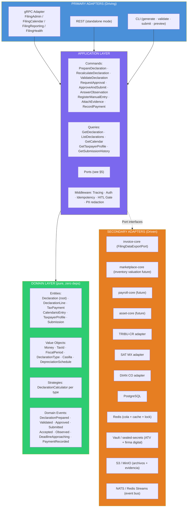
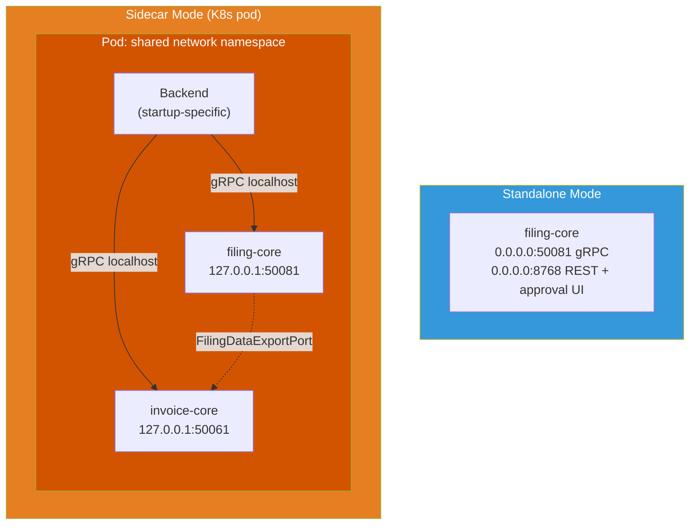
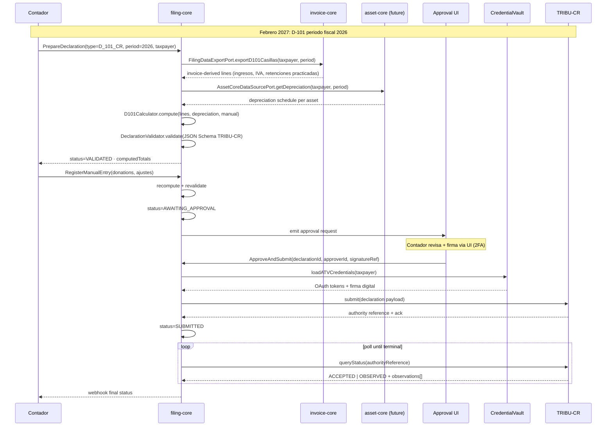
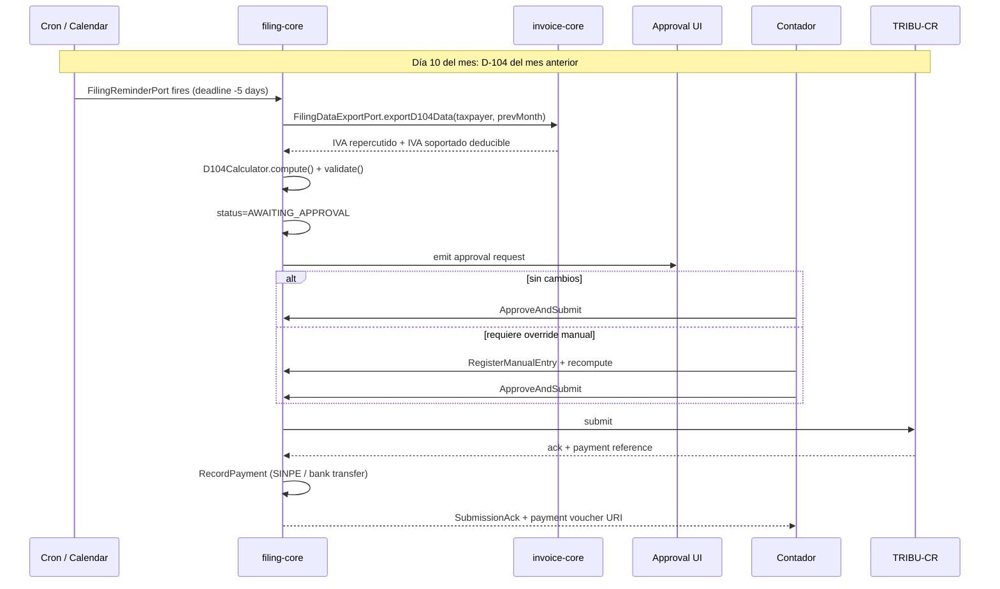

# filing-core — Preliminary Design Specification

> ## ⚠️ STATUS: APROBADO PERO DIFERIDO A YEAR 2 (2027) ⚠️
>
> Diseño **anticipatorio**, no plan de implementación activo. filing-core obtuvo **5/5 en la rúbrica** (`2026-04-16-core-governance-rubric.md` §5) pero se **difiere a year 2** porque no es blocker para ninguna startup hoy.
>
> **Solución intermedia vigente**: `invoice-core` v1 expone `FilingDataExportPort` que pre-rellena casillas de D-101/D-104/D-103; el contador las presenta manualmente en TRIBU-CR web. Resuelve ~80% del dolor operativo.
>
> **Trigger de promoción** (cualquiera dispara construcción):
> 1. **≥2 startups** piden explícitamente "presentar automáticamente declaraciones" (no solo pre-rellenar).
> 2. **Volumen** hace que costo anual de horas-contador dedicadas a declaraciones exceda ~USD 15k.
>
> **Revisar anualmente**. Próxima revisión: **2027-04-16**.

---

**Fecha**: 2026-04-16
**Autor**: @lapc506 (Luis Andrés Peña Castillo / hello@chimeranext.dev)
**Estado**: **DISEÑO PRELIMINAR / DEFERRED**. No invocar `writing-plans` hasta que el trigger se dispare.
**Licencia**: BSL 1.1.
**Hospedaje previsto**: `github.com/lapc506/filing-core`. Paquete npm: `@lapc506/filing-core`.

## Documentos complementarios

- `2026-04-16-core-governance-rubric.md` — rúbrica §5 "filing-core verdict".
- `invoice-core/docs/superpowers/specs/2026-04-16-invoice-core-design.md` — diseño padre. filing-core consume `FilingDataExportPort`.
- `2026-04-16-invoice-core-hallazgos.md` — §5 (Hacienda Digital = TRIBU-CR + ATENA + CR-Teza), §13 (fuentes).
- `agentic-core/README.md` — patrón arquitectónico de referencia.

---

## 1. Contexto y motivación (por qué eventualmente existirá)

Las 4 startups (HabitaNexus, AltruPets, Vertivolatam, AduaNext) deben presentar declaraciones tributarias en CR (y eventualmente MX/CO). Hoy el flujo es: contador toma export de invoice-core → pega en TRIBU-CR web → firma → archiva comprobante.

**Por qué es aceptable en Year 1**:

- Volumen bajo (≤4 declarantes CR; 0 declarantes MX/CO hasta expansión de HabitaNexus).
- Declaraciones ya están 80% pre-rellenadas vía `FilingDataExportPort`.
- El contador agrega juicio fiscal humano (deducibles, depreciaciones, donaciones).
- Costo marginal de construir filing-core supera costo del contador a este volumen.

**Por qué eventualmente sí tendrá sentido** (cuando el trigger dispare):

- **Reuso cross-startup**: 4 declarantes CR + expansión MX/CO multiplica 4-8× el esfuerzo manual.
- **Complejidad que duplicar es caro**: depreciación por tipo de activo (Reglamento Ley 7092), tramos ISR PJ, donaciones topadas al 10% renta neta, retenciones acreditables, tramos IVA por tarifa.
- **Aislamiento de credenciales**: ATV + firma digital por contribuyente; pod aislado análogo a invoice-core.
- **Rate-limits en ventanas de presentación**: picos al final de mes; centralizar cola + retry evita duplicar la lógica por backend.

**Valor sobre la solución actual**:

| Dimensión | Hoy (`FilingDataExportPort`) | Mañana (filing-core) |
|---|---|---|
| Agregación de datos | ✅ por declaración individual | ✅ multi-fuente (invoice + payroll + assets + manual) |
| Cálculo fiscal | Manual por contador | Automático (depreciación, tramos ISR, deducibles) |
| Validación schema | N/A (contador pega valores) | JSON Schema TRIBU-CR · XSD SAT · UBL DIAN |
| Presentación | Manual en web | API autoridad con HITL approval |
| Estado + audit | Screenshot/PDF manual | State machine + archivo SHA-256 chained |
| Recordatorio deadline | Calendar humano | `CalendarioFiscalPort` + `FilingReminderPort` |

## 2. Decisiones cerradas

| Decisión | Valor | Rationale |
|---|---|---|
| Estado | **DIFERIDO a Year 2 (2027)** | No blocker; invoice-core resuelve 80% |
| Lenguaje | **TypeScript 5.x strict** | Alineación con invoice-core / marketplace-core / compliance-core |
| Runtime | **Node.js 22 LTS** | Alineación con ecosistema |
| Arquitectura | **Hexagonal + ports & adapters** | Patrón establecido |
| Transporte | **gRPC sidecar + REST standalone** | Consistente con invoice-core / compliance-core |
| Puerto gRPC | **`:50081`** | Distinto de agentic (`:50051`), invoice (`:50061`), compliance (`:50071`) |
| Puerto REST | **`:8768`** | Distinto de agentic (`:8765`), invoice (`:8766`), compliance (`:8767`) |
| Licencia | **BSL 1.1** | `feedback_bsl_license.md` |
| Hospedaje | `github.com/lapc506/filing-core` | Personal; posible migración CIHUBS en Year 3 |
| Auto-submit | **Prohibido sin aprobación humana** | Declaraciones high-stakes; HITL mandatorio como invariante |
| Fuente primaria de datos | **invoice-core vía `FilingDataExportPort`** | No duplicar lógica de agregación |
| Scope geográfico | **CR P0 · MX P2 · CO P2** | CR tiene las 4 startups; MX/CO siguen a HabitaNexus |
| Multi-tenant | **Single-tenant por operador** | Igual que invoice-core v1 |

## 3. Arquitectura

### 3.1 Layered (Explicit Architecture)



### 3.2 Deployment modes (quad-sidecar)



Puerto `:50081` elegido para permitir quad-sidecar (agentic + marketplace-consumers + invoice + filing) en el mismo pod.

## 4. Domain Model

```ts
export type DeclarationType =
  // Costa Rica (TRIBU-CR)
  | "D_101_CR"    // Renta Anual PJ/PN
  | "D_104_CR"    // IVA mensual
  | "D_103_CR"    // Retenciones en la fuente
  | "D_150_CR" | "D_151_CR" | "D_152_CR"  // informativas
  | "D_195_CR"    // Activos y Pasivos
  | "D_408_CR"    // Donatarios (solicitud/renovación)
  // México (SAT)
  | "ANUAL_PM_MX" | "PROV_ISR_MX" | "DIOT_MX"
  // Colombia (DIAN)
  | "F_110_CO" | "F_210_CO" | "F_300_CO" | "F_350_CO";

export type DeclarationStatus =
  | "DRAFT" | "CALCULATED" | "VALIDATED" | "AWAITING_APPROVAL"
  | "READY" | "SUBMITTED" | "ACCEPTED" | "OBSERVED"
  | "RESOLVED" | "REJECTED" | "CANCELLED";

export type CasillaSource = "AUTO_INVOICE" | "AUTO_PAYROLL" | "AUTO_ASSET" | "MANUAL" | "CALCULATED";

export interface DeclarationLine {
  casillaCode: string;          // ej "D101_101_IngresosGravables"
  label: string;
  value: Money | Decimal | string;
  source: CasillaSource;
  sourceReference?: URI;        // pointer a doc invoice-core, manual entry, etc.
  notes?: string;
}

export interface Declaration {
  id: UUID;
  type: DeclarationType;
  jurisdiction: "CR" | "MX" | "CO";
  taxpayer: TaxpayerProfile;
  fiscalPeriod: { year: number; month?: number; bimester?: number };
  status: DeclarationStatus;
  lines: DeclarationLine[];
  computedTotals: {
    baseImponible: Money;
    impuestoDeterminado: Money;
    retencionesAcreditables: Money;
    pagosParciales: Money;
    saldoAPagar: Money;
    saldoAFavor: Money;
  };
  payment?: TaxPayment;
  submission?: Submission;
  attachments: URI[];
  approvedBy?: string;             // human approver (required for READY)
  approvedAt?: ISODateTime;
  auditTrail: DomainEvent[];
}

export interface TaxPayment {
  declarationId: UUID;
  amount: Money;
  method: "BANK_TRANSFER" | "SINPE" | "CREDIT_CARD" | "OFFSETTING";
  paidAt: ISODateTime;
  voucher: URI;
}

export interface Submission {
  authorityReference: string;
  submittedAt: ISODateTime;
  acknowledgmentBlob: URI;
  acceptedAt?: ISODateTime;
  observations?: string[];
}

export interface TaxpayerProfile {
  taxId: TaxId;
  legalName: string;
  jurisdiction: "CR" | "MX" | "CO";
  regime: string;                  // ej "Tradicional PJ", "RESICO", etc.
  atvCredentialRef?: VaultRef;     // CR
  firmaDigitalCertRef?: VaultRef;
  fiscalYearStart: ISODate;
  fiscalYearEnd: ISODate;
}

export interface CalendarioEntry {
  declarationType: DeclarationType;
  jurisdiction: "CR" | "MX" | "CO";
  period: string;
  deadline: ISODate;
  reminders: ISODate[];            // ej [-30d, -14d, -7d, -1d]
}
```

### State machine

```
DRAFT → CALCULATED → VALIDATED → AWAITING_APPROVAL → READY → SUBMITTED
                                         ↓                        ↓
                                       DRAFT          ACCEPTED | OBSERVED | REJECTED
                                                          ↓
                                                       RESOLVED (back to SUBMITTED)
```

**Invariante crítica**: `SUBMITTED` solo alcanzable desde `READY`. `READY` solo alcanzable si `approvedBy` poblado. No hay camino de código a auto-submit.

## 5. Ports Catalog

| # | Port | Responsabilidad | Adapters |
|---|---|---|---|
| 1 | `TaxAuthorityFilingPort` | `submit` · `queryStatus` · `answerObservation` | `TRIBUCRAdapter` · `SATMXAdapter` · `DIANCOAdapter` |
| 2 | `DeclarationRepository` | CRUD + query | PostgreSQL |
| 3 | `DeclarationCalculator` | Strategy por tipo | `D101Calculator` · `D104Calculator` · `AnualPMCalculator` · `F110Calculator` · etc. |
| 4 | `DeclarationValidator` | Schema per jurisdicción | JSON Schema TRIBU-CR · XSD SAT · UBL DIAN |
| 5 | `TaxpayerProfileRepository` | Perfil fiscal | PostgreSQL |
| 6 | `CalendarioFiscalPort` | Plazos por jurisdicción | Static seed + cron refresh |
| 7 | `FilingReminderPort` | Alertas pre-deadline | NATS / email / Slack |
| 8 | `InvoiceCoreDataSourcePort` | Consume `FilingDataExportPort` | gRPC client |
| 9 | `MarketplaceCoreDataSourcePort` (P2) | Valuación inventario | gRPC client |
| 10 | `PayrollCoreDataSourcePort` (P3) | D-103 retenciones salariales | gRPC client (future) |
| 11 | `AssetCoreDataSourcePort` (P3) | Activos fijos + depreciación | gRPC client (future) |
| 12 | `ManualEntryPort` | Entradas manuales del contador | REST + UI |
| 13 | `ApprovalGatewayPort` | HITL: emite request + espera approval | REST webhook + email link |
| 14 | `CredentialVaultPort` | ATV + firma digital | Vault / sealed-secrets |
| 15 | `EvidenceArchivePort` | Archivo inmutable | S3 Object Lock + SHA-256 chaining |
| 16 | `PaymentVoucherPort` | Comprobante de pago PDF | PDF generator + storage |
| 17 | `EventBus` | Publish + subscribe | NATS · Redis Streams |
| 18 | `ObservabilityPort` | Logs + spans + metrics | structlog + OTel + Prometheus |

## 6. gRPC Services (proto skeleton)

```proto
syntax = "proto3";
package filing_core.v1;

service FilingAdmin {
  rpc PrepareDeclaration(PrepareDeclarationRequest) returns (DeclarationAck);
  rpc RecalculateDeclaration(RecalculateRequest) returns (DeclarationAck);
  rpc ValidateDeclaration(ValidateRequest) returns (ValidationResult);
  rpc RequestApproval(RequestApprovalRequest) returns (ApprovalRequestAck);
  rpc ApproveAndSubmit(ApproveSubmitRequest) returns (SubmissionAck);
  rpc AnswerObservation(AnswerObservationRequest) returns (DeclarationAck);
  rpc RegisterManualEntry(ManualEntryRequest) returns (DeclarationLine);
  rpc AttachEvidence(AttachEvidenceRequest) returns (EvidenceAck);
  rpc RecordPayment(RecordPaymentRequest) returns (TaxPayment);
  rpc GetDeclaration(GetDeclarationRequest) returns (Declaration);
  rpc ListDeclarations(ListDeclarationsRequest) returns (stream Declaration);
  rpc GetSubmissionHistory(HistoryRequest) returns (stream Submission);
}

service FilingCalendar {
  rpc GetCalendar(CalendarRequest) returns (stream CalendarioEntry);
  rpc GetUpcomingDeadlines(UpcomingRequest) returns (stream CalendarioEntry);
  rpc SubscribeReminders(SubscribeRequest) returns (stream DeadlineReminder);
}

service FilingReporting {
  rpc GetTaxpayerProfile(ProfileRequest) returns (TaxpayerProfile);
  rpc ListObservations(ObservationsRequest) returns (stream Observation);
  rpc GenerateExecutiveSummary(SummaryRequest) returns (ExecutiveSummary);
}

service FilingHealth {
  rpc CheckAuthorityHealth(CheckAuthorityRequest) returns (AuthorityHealthStatus);
  rpc GetPendingApprovals(PendingApprovalsRequest) returns (stream PendingApproval);
  rpc GetCircuitBreakerState(CircuitBreakerRequest) returns (CircuitBreakerStatus);
}
```

Proto versionado por namespace (`v1`). Breaking changes → `v2` coexistente.

## 7. Declaration type catalog per jurisdiction

| Jurisdicción | Tipo | Periodicidad | Obligados | Fuentes clave | Prioridad |
|---|---|---|---|---|:---:|
| CR | D-101 Renta Anual | Anual (15 mar) | PJ/PN con actividad | Invoice, Asset, Manual | P0 |
| CR | D-104 IVA | Mensual (15 del mes sig) | Contribuyentes IVA | Invoice | P0 |
| CR | D-103 Retenciones | Mensual (15 del mes sig) | Agentes de retención | Payroll, Invoice | P0 |
| CR | D-150 Clientes | Anual (30 nov) | Seleccionados DGT | Invoice top clientes | P1 |
| CR | D-151 Proveedores | Anual (30 nov) | Seleccionados DGT | Invoice top proveedores | P1 |
| CR | D-152 Entidades | Anual (30 nov) | Selección | Manual + Invoice | P1 |
| CR | D-195 Activos/Pasivos | Anual (con D-101) | PJ | Asset + Manual | P1 |
| CR | D-408 Donatarios | Bianual | Donatarios autorizados | Manual + Invoice | P1 |
| MX | Anual PM | Anual (31 mar) | PM residentes | Invoice + Payroll + Asset + Manual | P2 |
| MX | Pagos Provisionales ISR | Mensual (17 del mes sig) | PM | Invoice + Manual | P2 |
| MX | DIOT | Mensual | Contribuyentes IVA | Invoice operaciones con terceros | P2 |
| CO | Formulario 110 | Anual (abr-may) | PJ | Invoice + Asset + Manual | P2 |
| CO | Formulario 300 IVA | Bimestral | Responsables IVA | Invoice | P2 |
| CO | Formulario 350 Retenciones | Mensual | Agentes retenedores | Payroll + Invoice | P2 |
| CO | Formulario 210 | Anual | PN | Invoice + Manual | P3 |

## 8. Data flows

### 8.1 D-101 Renta Anual CR — preparación y submission



### 8.2 D-104 IVA mensual CR — ciclo recurrente



## 9. Capability Matrix

| Capability | Prioridad | Fase |
|---|:---:|:---:|
| D-101 / D-104 / D-103 CR | P0 | 1 |
| `FilingDataExportPort` consumer | P0 | 1 |
| HITL approval gate (invariante) | P0 | 1 |
| CalendarioFiscalPort CR + reminders | P0 | 1 |
| TRIBUCRAdapter | P0 | 1 |
| EvidenceArchivePort con SHA-256 chaining | P0 | 1 |
| gRPC + REST + sidecar/standalone | P0 | 1 |
| Observability stack | P0 | 1 |
| D-150/151/152/195 + D-408 CR | P1 | 2 |
| Observación response flow | P1 | 2 |
| SAT MX (Anual PM + Provisionales + DIOT) | P2 | 3 |
| DIAN CO (F-110 + F-300 + F-350) | P2 | 4 |
| Multi-tenant credentials | P2 | diferido |
| DIAN CO F-210 PN | P3 | 5 |
| `PayrollCoreDataSourcePort` | P3 | cuando payroll-core exista |
| `AssetCoreDataSourcePort` | P3 | cuando asset-core exista |
| Estimación tributaria predictiva | P4 | roadmap largo |

## 10. Testing strategy

- **Unit**: dominio puro con Vitest. >95% cobertura en `domain/`, énfasis en calculators (depreciación, tramos ISR, topes deducibles).
- **Calculator golden files**: cada calculator con set de golden inputs/outputs validados contra declaraciones reales pre-llenadas por contadores humanos.
- **Schema validation**: cada release valida output contra JSON Schema TRIBU-CR / XSD SAT / UBL DIAN oficiales.
- **Integration**: adapters contra TRIBU-CR sandbox (cuando DGT lo publique), SAT MX sandbox, DIAN CO set de pruebas.
- **Contract testing**: Pact entre filing-core ↔ invoice-core (contrato `FilingDataExportPort`).
- **Chaos**: TRIBU-CR down simulado; verificar cola + retry + NO pérdida de evidencia ni estado.
- **Compliance snapshot**: golden declarations por tipo; CI compara cada release contra snapshot para detectar regresiones fiscales.
- **HITL invariant tests**: validar que `SUBMITTED` sea inalcanzable sin `approvedBy` poblado.

## 11. Observability

Alineado con invoice-core y compliance-core.

- Logs: structlog JSON → Alloy → Loki.
- Traces: OTel SDK → OTLP → Tempo; correlación con invoice-core al consumir `FilingDataExportPort`.
- Metrics: `/metrics` Prometheus scrape.
- Métricas específicas:
  - `filing_declaration_prepared_total{type,jurisdiction}`
  - `filing_declaration_submitted_total{type,jurisdiction,outcome}` (outcome = accepted|observed|rejected)
  - `filing_authority_latency_seconds{authority,operation}` (histogram)
  - `filing_approval_wait_seconds` (histogram — time AWAITING_APPROVAL → READY)
  - `filing_deadline_violations_total{type,jurisdiction}` — **hard alert**
  - `filing_observations_total{type,jurisdiction}` (regulatory posture signal)
  - `filing_circuit_breaker_state{authority}`
- Alertas críticas:
  - Declaración pasa deadline sin `READY` → page immediately.
  - Approval pending > 48h antes del deadline → warn.
  - Authority p95 latency > 30s durante 10 min → warn.
  - Observación rate > 10% → regulatory posture anomaly.

## 12. Security model

Declaraciones son high-stakes (errores → multas + responsabilidad penal del representante legal). Security model es más estricto que invoice-core:

- **Credenciales ATV + firma digital**: jamás en config; solo vía `CredentialVaultPort` con hot-reload para renovaciones.
- **HITL mandatorio**: no existe camino de código a `SUBMITTED` sin `approvedBy`. Invariante testada.
- **Audit trail append-only**: SHA-256 chain de domain events; evidence archive inmutable (S3 Object Lock).
- **PII redaction middleware**: logs nunca contienen valores absolutos de casillas ni cédulas completas.
- **mTLS backend ↔ sidecar** (cert por startup).
- **gRPC unencrypted solo en sidecar loopback** (`127.0.0.1:50081`).
- **Approval UI**: 2FA (TOTP o WebAuthn) requerido antes de firmar `ApproveAndSubmit`.
- **Webhooks outbound**: HMAC-SHA256 con secret rotativo por startup.
- **Segregation of duties**: quien prepara ≠ quien aprueba (configurable; default on).
- **Credential rotation alerts**: firma digital renovación anual — alertas 90/60/30/14/7 días.

## 13. Regulatory landscape

**Costa Rica**: Ley 7092 ISR (arts. 1-80, incluye art. 8 inc. q donaciones) · Ley 6826 IVA (Ley 9635 Fortalecimiento Finanzas) · Código de Normas y Procedimientos Tributarios (Ley 4755) · Reglamento Ley 7092 (tablas de depreciación) · TRIBU-CR vigente desde 2025-10-06 (reemplazó ATV).

**México**: Ley ISR (PM título II, PN título IV) · Ley IVA (incluye art. 18-D / 18-J plataformas digitales no residentes) · Código Fiscal de la Federación · Resolución Miscelánea Fiscal anual + Anexo 27 RMF · SAT.

**Colombia**: Estatuto Tributario (Decreto 624/1989) · Ley 1819 de 2016 (reforma estructural) · Decreto 1091/2020 (servicios digitales exterior) · Art. 257 ET (donaciones ESALs) · DIAN muisca.

**Política de actualización**: subscripción a avisos oficiales; revisión trimestral por contador externo cuando filing-core esté activo; golden files re-validados contra schema oficial en cada release.

## 14. Roadmap

### Fase 0 — Trigger monitoring (2026-2027) · ESTADO ACTUAL

Nada se construye. Se monitorean dos condiciones:

1. **Demand signal**: ≥2 startups piden "presentar automáticamente" (no solo pre-rellenar).
2. **Economic signal**: horas-contador anuales dedicadas a declaraciones × tarifa excede USD 15k.

Revisión anual (próxima: 2027-04). Si trigger dispara, promover a Fase 1.

### Fase 1 — v0.1 MVP CR (6-8 semanas)

Gate: trigger confirmado + invoice-core estable en producción ≥3 meses.

- Scaffold TS + hexagonal. Proto `v1` + gRPC services.
- `TRIBUCRAdapter`, `DeclarationRepository`, `TaxpayerProfileRepository`, `CalendarioFiscalPort` CR.
- `InvoiceCoreDataSourcePort` (consume `FilingDataExportPort`).
- `D101Calculator` · `D104Calculator` · `D103Calculator`.
- `DeclarationValidator` JSON Schema TRIBU-CR.
- `ApprovalGatewayPort` + approval UI minimal.
- `CredentialVaultPort`, `EvidenceArchivePort` S3 Object Lock.
- HITL gate como invariante testada.
- Dockerfile + docker-compose + Helm chart. Observability stack. BSL 1.1 LICENSE.

### Fase 2 — v0.2 CR informativas + D-408 (2-3 semanas)

- `D150/D151/D152/D195Calculator`, `D408Calculator`.
- Flujo de respuesta a observaciones (`AnswerObservation`).

### Fase 3 — v0.3 SAT MX (4-6 semanas)

Gate: HabitaNexus con RFC MX activo + operaciones > umbral.

- `SATMXAdapter`, `AnualPMCalculator`, `PagosProvisionalesCalculator`, `DIOTCalculator`.
- Sello CSD SAT integration.

### Fase 4 — v0.4 DIAN CO (4-6 semanas)

Gate: HabitaNexus con NIT CO activo + operaciones > umbral.

- `DIANCOAdapter`, `F110Calculator`, `F300Calculator`, `F350Calculator`.

### Fase 5 — v0.5 cross-core integrations (cuando existan)

- `PayrollCoreDataSourcePort`, `AssetCoreDataSourcePort`, `MarketplaceCoreDataSourcePort`.

### Fase 6 — v1.0 GA

- Multi-tenant credentials (si demanda real).
- Estimación tributaria predictiva.
- Posible migración a CIHUBS.

## 15. Anti-scope

- NO emitir comprobantes electrónicos (→ `invoice-core`).
- NO calcular contabilidad interna / libro mayor (→ ERP externo o futuro `ledger-core`).
- NO automatizar nómina (→ futuro `payroll-core`).
- NO gestionar inventario ni valuación en ciclo (→ `marketplace-core` / futuro `asset-core`).
- NO KYC/AML (→ `compliance-core`).
- NO asesoría fiscal personalizada (contador humano aporta juicio; filing-core aporta ejecución).
- NO auto-submit sin aprobación humana (invariante no negociable).
- NO gestionar contratos legales (→ futuro `contract-core`).
- NO integración directa con ATENA aduanas (→ AduaNext backend; aduanas ≠ tributación).
- NO libros contables oficiales (→ ERP externo).

## 16. Riesgos

| Riesgo | Prob. | Impacto | Mitigación |
|---|:---:|:---:|---|
| Trigger nunca se dispara | Media | Bajo | Feature, no bug — se difiere sin pérdida |
| TRIBU-CR API cambia antes de construcción | Alta | Medio | Validators swappable; schema en config |
| Schema JSON/XSD cambia post-release | Media | Medio | Golden files + CI validation |
| Regulación cambia tramos ISR / deducibles | Alta | Alto | Calculators parametrizables por año; coeficientes en config, no código |
| Error de cálculo genera multa a startup | Media | Muy Alto | HITL + contador humano como segunda línea; filing-core asiste, contador firma |
| Firma digital expira sin aviso | Alta (anual) | Alto | CredentialVault con expiry monitoring + alertas 90/60/30/14/7 días |
| TRIBU-CR sin API programática suficiente | Media | Alto | Fallback: archivo listo para upload manual |
| Observación interpretada mal por código | Media | Medio | `AnswerObservation` siempre pasa por HITL; NUNCA auto-responde |
| Scope creep hacia contabilidad interna | Media | Alto | Anti-scope §15 explícito; revisar en PRs |
| Premature construction | Baja | Alto | Rúbrica §5 + este spec reiteran trigger; no construir sin disparo |

## 17. Spec self-review

- [x] Header marca prominentemente DEFERRED TO YEAR 2.
- [x] Trigger de promoción claro (§14 Fase 0).
- [x] Referencia `FilingDataExportPort` como solución intermedia (§1, §5 #8, §9).
- [x] Arquitectura alineada con patrón del ecosistema (gRPC sidecar, hexagonal).
- [x] Puertos `:50081` / `:8768` distintos a los 3 `-core` anteriores.
- [x] HITL mandatorio reiterado (§2, §4, §5 #13, §12, §15).
- [x] Calculators por tipo catalogados (§7).
- [x] Anti-scope diferencia filing-core de otros `-core` (§15).
- [x] Regulatory landscape por jurisdicción (§13).
- [x] Roadmap empieza con "Fase 0 — Trigger monitoring" (no construcción).
- [x] Riesgos incluye "premature construction" y "trigger nunca dispara" (§16).
- [x] Mermaids validan en GitHub render.
- [x] File paths absolutos a docs complementarios.
- [x] 18 secciones presentes.

## 18. Próximos pasos

1. **NO invocar `writing-plans`** hasta que trigger (§14 Fase 0) dispare.
2. **Re-revisar anualmente**: próxima revisión 2027-04-16.
3. **Monitorear señales de demanda**: si cualquier startup pide "automatizar declaración X" o "no quiero pasar por el contador para presentar X", documentar en issue y re-evaluar.
4. **Monitorear señal económica**: al cierre de cada año fiscal, estimar horas-contador × tarifa; si excede USD 15k/año, promover a Fase 1.
5. **Actualizar este spec** si invoice-core cambia `FilingDataExportPort` de forma no compatible (el port es contrato público).
6. **Actualizar este spec** si surgen `payroll-core` o `asset-core` (afectan §5 ports #10-11).
7. **Mantener `FilingDataExportPort` como producto vivo** en invoice-core; cada mejora ahí reduce la urgencia de filing-core.
8. **Al construir eventualmente**, invocar en orden:
   - `superpowers:writing-plans` → implementation plan.
   - `make-no-mistakes:linear-projects-setup` → workspace Linear.
   - `make-no-mistakes:implement <issue-ID>` → por fase, con disciplina de worktree isolation.

---

## Apéndice A — Relación con otros `-core`

| Consume de | Provee a |
|---|---|
| `invoice-core` (`FilingDataExportPort`) | Contadores externos vía export package |
| (futuro) `payroll-core` (D-103 retenciones salariales) | Reportes ejecutivos de posición fiscal |
| (futuro) `asset-core` (depreciación D-101) | Evidencia archivada para auditoría regulatoria |
| (futuro) `marketplace-core` (inventario fin de año) | |
| `compliance-core` (potencial: validar taxpayer status) | |

## Apéndice B — Fuentes regulatorias clave

**CR**: [TRIBU-CR portal](https://www.hacienda.go.cr/TRIBU-CR.html) · [Preguntas y respuestas TRIBU-CR (PDF)](https://www.hacienda.go.cr/docs/dPreguntasYRespuestasDeTRIBU-CR.pdf) · [El Financiero — nuevas casillas D-101](https://www.elfinancierocr.com/economia-y-politica/renta-en-tribu-cr-las-nuevas-casillas-de-la/KLBYDZRIM5FG7BFDC2MSJNVQGQ/story/) · [Officium Legal — TRIBU-CR guía](https://blog.officiumlegal.com/es/derecho-tributario/tribu-cr-todo-lo-que-necesita-saber-sobre-el-nuevo-sistema-de-tributacion) · Ley 7092 ISR · Ley 6826 IVA · CNPT.

**MX**: LISR · LIVA arts. 18-D / 18-J · CFF · RMF Anexo 27.

**CO**: Estatuto Tributario · Ley 1819 de 2016 · Decreto 1091/2020 · Art. 257 ET.

## Apéndice C — Referencias del ecosistema

- `invoice-core` spec: `invoice-core/docs/superpowers/specs/2026-04-16-invoice-core-design.md`
- Governance rubric (§5 filing-core verdict): `2026-04-16-core-governance-rubric.md`
- Hallazgos invoice-core (§5 Hacienda Digital, §13 fuentes): `2026-04-16-invoice-core-hallazgos.md`
- `agentic-core` repo: `agentic-core/`
- `marketplace-core` repo: `marketplace-core/`
- Explicit Architecture — Herbert Graca: https://herbertograca.com/2017/11/16/explicit-architecture-01-ddd-hexagonal-onion-clean-cqrs-how-i-put-it-all-together/
