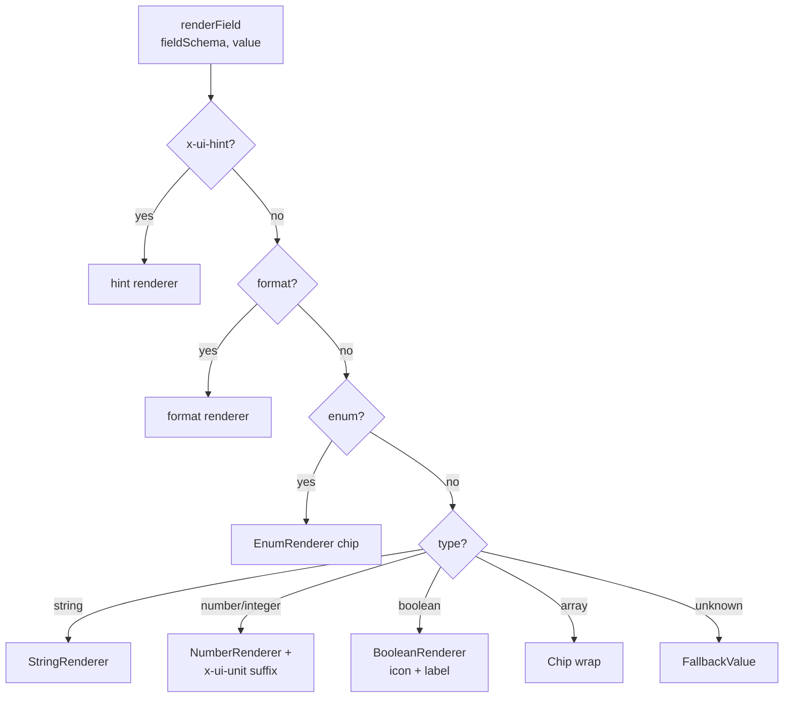

# JSON Schema Renderer — Design Notes

> Lives in `ui/lib/shared/`. Consumes the merchant schema + attribute
> values, emits Flutter widgets. Zero hardcoded field names.

## The core claim

> Given any JSON Schema describing an object, and an attributes map
> whose keys match the schema's `properties`, the renderer produces a
> coherent product detail view — regardless of which industry the
> schema describes.

## Dispatch



Priority matters: `x-ui-hint` wins first so schema authors can override
the default rendering without mutating data shapes. For example:

```json
{ "type": "string", "x-ui-hint": "badge" }   // chip instead of text
{ "type": "string", "x-ui-hint": "color" }   // colored swatch
```

## Widget map

| Selector (ordered)               | Output widget                |
|----------------------------------|------------------------------|
| `x-ui-hint: geo`                 | `GeoRenderer` (pin + coords) |
| `x-ui-hint: sensor`              | `SensorRenderer`             |
| `x-ui-hint: color`               | `ColorRenderer` (swatch)     |
| `x-ui-hint: money`               | `MoneyRenderer`              |
| `x-ui-hint: badge`               | `BadgeRenderer` (chip)       |
| `x-ui-hint: image`               | `ImageRenderer`              |
| `x-ui-hint: image-gallery`       | `ImageGalleryRenderer` (wrap)|
| `x-ui-hint: url`                 | `UrlRenderer`                |
| `format: date`                   | `DateRenderer` (date only)   |
| `format: date-time`              | `DateRenderer` (w/ time)     |
| `format: uri`                    | `UrlRenderer`                |
| `enum: [...]`                    | `EnumRenderer` (chip)        |
| `type: string`                   | `StringRenderer`             |
| `type: number` / `type: integer` | `NumberRenderer` + unit      |
| `type: boolean`                  | `BooleanRenderer` (icon)     |
| `type: array`                    | `Chip` wrap (fallback)       |
| —                                | `FallbackValue` (`$value`)   |

## Property ordering

Top-level renderer looks at the schema in this order:

1. `x-ui-order` — explicit list of property names.
2. `required` — required fields first, then the rest.
3. Insertion order of `properties`.

The first non-empty hit wins. Any property referenced in
`x-ui-order`/`required` that isn't declared is silently skipped — the
PR-6 schema validator will flag these at CI time.

## Property labels

1. `properties[key].title` if non-empty string.
2. Humanised key: camelCase + snake_case + kebab-case → Title Case
   (e.g. `harvestDate` → "Harvest Date").

## Browse cards (`ProductBrowseCard`)

A separate widget optimised for grid layouts. Schema-driven via
`x-ui-browse-fields`:

```json
"x-ui-browse-fields": ["bedrooms", "monthlyRent", "locationGeo"]
```

Up to 3 properties render as label + value rows on the card.
The `Product` message's top-level `title`, `description`, and `tags`
render regardless (they're schema-independent).

## Deliberate limits (spike scope)

- **No form rendering.** The renderer is read-only. A schema-driven
  form (for admin) needs different primitives and input validation,
  and is out of spike scope.
- **Placeholder image widget.** Real network images need a loader +
  cache + error state. We display a thumbnail silhouette + the URL so
  layout decisions remain honest without pulling in `cached_network_image`.
- **No intl for date/number formatting.** Dates render `YYYY-MM-DD`
  deterministically; numbers render as Dart's default `toString`. A
  follow-up PR can wire `intl` once locale strategy is decided.
- **No `url_launcher`.** URLs render with an underline but don't open
  a browser on tap. Deferred because desktop launcher on Linux is
  Wayland/X11 flaky.

## Testing strategy (#7 delivered)

- **Unit tests per widget type** — `tests/shared/renderers/field_dispatcher_test.dart`
  covers 24 combinations of (type × hint × format).
- **End-to-end against real schemas** — `tests/shared/json_schema_renderer_test.dart`
  loads each of the three reference schemas from disk and asserts key
  labels render. Uses `File.readAsStringSync` (not `await`), because
  `flutter_test` runs in a fake async zone that blocks real-time I/O.
- **Browse card** — `tests/shared/json_schema_browse_test.dart` covers
  preview field selection + tag truncation + onTap.

## Common pitfalls

- **Horizontal `ListView` inside `SingleChildScrollView` hangs tests.**
  Use `Wrap` for galleries — the renderer is always embedded in a
  scrollable parent.
- **`await File.readAsString()` inside `testWidgets` hangs.** The fake
  async zone never advances real time. Use sync reads in tests or wrap
  the I/O in `tester.runAsync`.
- **Biome `noShadowRestrictedNames`** — don't name helpers `escape`,
  `Document`, etc. Use `escapeQuote` / similar.
