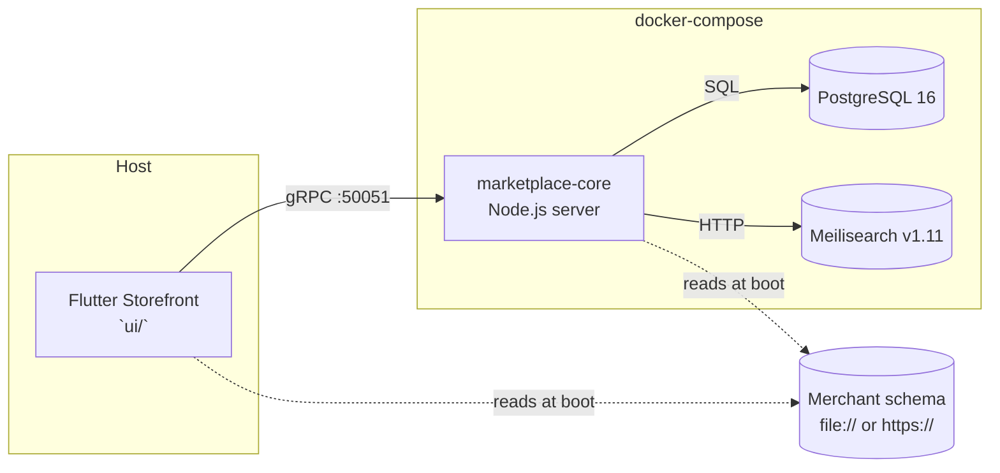
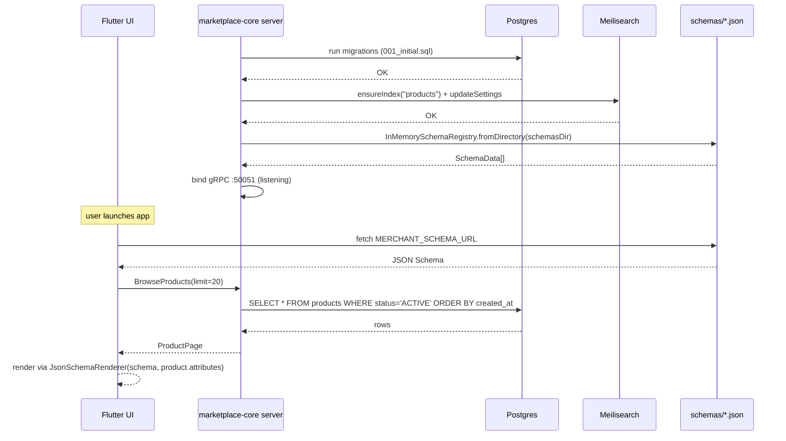
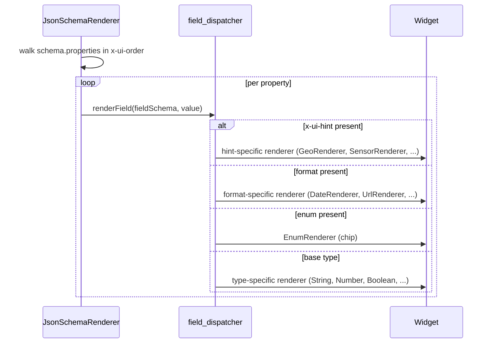

# Standalone Storefront — Architecture

> **Goal.** One Flutter binary renders three radically different
> marketplaces — hortalizas frescas (Vertivolatam), rental properties
> (HabitaNexus), pet supplies (AltruPets) — just by swapping
> `MERCHANT_SCHEMA_URL`. The renderer carries zero domain knowledge.

## High-level topology

- The **server** knows product catalog shape (Product + attributes JSONB)
  but doesn't know the *semantics* of any specific merchant.
- The **Flutter UI** knows how to render any JSON Schema (via the
  renderer from #7/PR-5) but has zero hard-coded merchant names.
- The **merchant schema** sits outside both and teaches each side how
  to interpret the other's data.

## Boot sequence

The schema is loaded on **both** sides independently. The server uses it
to validate incoming product creates (future); the UI uses it to decide
what widget to emit for each attribute.

## Read-path RPCs implemented (#5/PR-3)

| RPC               | Implementation                             |
|-------------------|---------------------------------------------|
| BrowseProducts    | `PostgresProductRepository.list` + cursor   |
| GetProductDetail  | `findById` or `findBySlug`                  |
| SearchProducts    | `MeilisearchEngine.search`                  |
| ListCollections   | UNIMPLEMENTED (follow-up)                   |
| GetCollection     | UNIMPLEMENTED (follow-up)                   |
| GetStorefront     | UNIMPLEMENTED (follow-up)                   |
| GetVendorProfile  | UNIMPLEMENTED (follow-up)                   |

UNIMPLEMENTED is intentional: the UI can detect the status and fall
back to empty states without crashing, and "this lands in a follow-up
PR" travels alongside the method so consumers know.

## Data flow — attribute round-trip

Dispatch priority is strict: `x-ui-hint` → `format` → `enum` → `type`.
This lets schema authors override any default by dropping a hint on a
property without changing the data shape.

## Why this is worth shipping as a library

Every new consumer (Vertivo, HabitaNexus, AltruPets, AduaNext, Keiko,
MeshCommerceChain) gets the same Storefront app and only authors a
JSON Schema. No Flutter code per merchant. The gRPC server is a single
deployment they can share or fork.

## Next steps (beyond this spike)

- [ ] Collection + Vendor + Storefront persistence + RPCs.
- [ ] Integration tests against live compose (#5 excluded those from
      coverage; a follow-up PR will add a compose-backed test suite).
- [ ] Real `url_launcher` and `Image.network` behind a feature flag
      (the spike uses placeholders to keep layout honest).
- [ ] Flutter matrix in GH Actions CI (deferred per PR-4's tradeoff).
- [ ] Authenticated Admin service (`MarketplaceAdmin`) for merchant-side
      dashboards.
