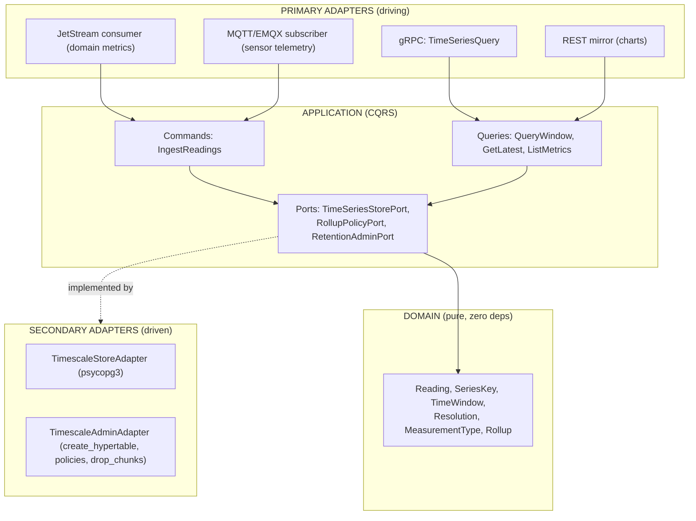

# ADR — timeseries-core architecture: hypertable, continuous aggregates, dual ingress, query contract, broker coupling

**Date:** 2026-06-21
**Domain:** `timeseries-core`
**Decision:** **Defer extraction** (single real consumer today). Specify the full design now so
the future extraction is a cheap adapter swap behind a façade, not a rewrite. The shared
service, when extracted, owns a **TimescaleDB** storage engine (hypertable + hierarchical
continuous aggregates + per-tenant compression/retention), ingests from **two disjoint
channels** (event-bus for low-frequency domain metrics; MQTT/EMQX direct + OTLP for
high-frequency telemetry), and exposes a **Protobuf/gRPC** window-rollup query contract.
**Stack peer:** mirrors `services/geospatial-core/` and `services/vision-core/` (hexagonal
`src/`, ports/adapters, proto-first gRPC+REST, BUSL-1.1).

> **Source-of-truth note on `V_final`.** The Vertivo spec defines **no `V_final` formula**.
> The sensor emits a single flat scalar — `value double precision` — inserted directly from
> the MQTT JSON payload (`sensor_ingestion_service.dart:46`, `value: data['value'] as double`).
> Treat "V_final" as "the raw sensor scalar `value`". What is real and load-bearing are the
> **rollups**: `avg/min/max/count` over `value`, grouped by `(greenhouseId, measurementType)`
> (Vertivo `design.md` D3, lines 70–82). This ADR builds storage around the real scalar, not
> an invented formula.

---

## 1. Investigation questions — answers

### Q1. How many *real* (not hypothetical) consumers today vs roadmap?

**One real consumer: Vertivo** (greenhouse sensor telemetry: MQTT → Serverpod → `insertRow`
into `environmental_readings`, read by dashboard/app charts). The other four products
(habitanexus, aduanext, altrupets, keikolatam) have **no declared time-series need** — their
"metrics" are reputation (7 signals, on-chain), e-commerce ratings, and discrete domain events;
a different domain that does **not** share the MQTT/sensor spine. The only plausible *second*
time-series consumer is **`digitaltwin-core`** — which is **research-only (no code)** and would
consume the *same* Vertivo series (it already sketches a `TimeSeriesStorePort` +
`TimescaleDbAdapter` over the same MQTT/Serverpod spine). **Verdict:** one real consumer →
the boundary today is intra-process, not a microservice.

### Q2. Does the event-bus exist / what broker for this stage? Does the analytical sink change it?

The bus's recommended broker for this stage is **NATS JetStream**
(`eventbus-broker-analysis.md:150, 807`); Decision 2 is **Protobuf** (`:484, 808`). The
analytical-sink signal (*"a heavy data channel toward an analytical store" → Kafka*,
`:324`) **does not change the recommendation in this case**, because the heavy load does
**not** flow through the bus — it enters via **MQTT/EMQX direct** (see §5 and §6). EMQX
(MQTT 5, operator 5.8.6, namespace `vertivo-dev`) is already ground-truth in Vertivolatam
(`:904`); the bus carries only low-frequency domain metrics, far below the Kafka threshold
(100 000 msg/s, `:229`; revisit threshold 500 000 ev/s + >3-month retention, `:325`).

### Q3. High-frequency telemetry — direct into the service, OTLP, or the bus? How is it separated from domain metrics?

**Direct MQTT into the service for product telemetry; OTLP (kept separate, to Prometheus) for
observability; the bus only for low-frequency domain metrics.** See §5 for the disjoint split.
Sensor readings are *product data* (pH, CO₂, temperature) that belong in the queryable
hypertable; OTLP would only add a collector that repackages MQTT→OTLP with no gain and would
mix product data with infra telemetry. Observability of the ingest path itself (consumer lag,
ingest latency, throughput) goes to OTLP→Prometheus, **never** the business hypertable.

### Q4. How expensive is a shared TimescaleDB vs N Postgres per product?

A single TimescaleDB with compression + continuous aggregates **consolidates hot-storage cost**
and scales well to 10–100×; the real cost is **operational** (another critical DB) and
**tenant isolation**. N Postgres-per-product multiplies connections, extensions, policy sets
and backups, and loses cheap cross-tenant rollups — but maximises isolation/blast-radius
control. **Verdict:** a shared TimescaleDB is cheaper *once there are ≥2 real consumers*;
with one consumer, the shared instance is pure premature ops cost vs Vertivo's own Postgres.
This is exactly why the decision is **defer** (PDR).

---

## 2. Architecture — hexagonal, ports & adapters

All arrows point inward; infrastructure (TimescaleDB, MQTT, the bus) depends on
**domain-defined ports**, never the reverse — same discipline as geospatial-core/agentic-core.



**Ports (the contract surface):**

| Port | Responsibility | Adapter |
|---|---|---|
| `TimeSeriesStorePort` | `write_readings`, `query_rollup(window, resolution)`, `get_latest` | `TimescaleStoreAdapter` (psycopg3 → hypertable + CAGGs) |
| `RollupPolicyPort` | Which continuous aggregate serves a given `(range, resolution)` | domain service (range→CAGG heuristic) |
| `RetentionAdminPort` | Per-tenant compression/retention, filtered `drop_chunks` | `TimescaleAdminAdapter` |

This is the **same port shape** sketched on the Vertivo side (`TimeSeriesStorePort` /
`TimescaleDbAdapter` in `digitaltwin-core-research.md`), so the strangler cutover (Fase 3) is a
swap from a local TimescaleDB adapter to a gRPC client adapter — no domain rewrite.

## 3. Data model & hypertable

**Source model (Vertivo `environmental_readings`):** `id bigserial PK`, `greenhouseId bigint`,
`measurementType text`, `value double precision`, `unit text`, `source text?`,
`isAnomaly boolean`, `createdAt timestamp WITHOUT time zone` (the partitioning column).
The PK clash (R1): a hypertable needs `createdAt` in every PK/UNIQUE; Serverpod regenerates
`PRIMARY KEY (id)` — resolved by the **custom-SQL post-deploy step** (Option 3), not by editing
ORM migrations.

**Generic hypertable for the shared core** (adds the multi-tenancy column — see §4):

```sql
CREATE TABLE readings (
  ts             timestamptz       NOT NULL,   -- partitioning column (UTC-aware)
  product_id     smallint          NOT NULL,   -- multi-tenancy (vertivo, payments-core, ...)
  tenant_id      text              NOT NULL,    -- sub-tenancy within a product
  series_key     text              NOT NULL,    -- e.g. greenhouseId for Vertivo
  measurement    text              NOT NULL,    -- temperature | humidity | ph | ...
  value          double precision  NOT NULL,    -- the raw scalar ("V_final" is just this)
  unit           text              NOT NULL
);
SELECT create_hypertable('readings', 'ts',
  chunk_time_interval => INTERVAL '1 day',      -- IoT high-freq: 1d caps the hot chunk
  if_not_exists => TRUE, migrate_data => TRUE);
```

Rationale for **1-day chunks** (vs TimescaleDB's 7-day default): the hot chunk + its indexes
should fit in ~25 % of RAM; with multi-tenant high-frequency telemetry (fleet × greenhouses ×
sensors × types), 1 day bounds it better than 7.

## 4. Multi-tenancy — `product_id` + RLS

The Vertivo spec is single-product. For a shared instance, three strategies:

| Strategy | Isolation | Per-product retention | Cost | Verdict |
|---|---|---|---|---|
| **`product_id` column + RLS** | logical (row-level) | filtered `drop_chunks` jobs | lowest | **default** |
| Schema-per-tenant | strong (independent policies/CAGGs) | native, per schema | medium (N migrations) | fallback if a product's profile diverges |
| DB-per-tenant | maximal (backup/security/blast radius) | native, per DB | highest | only for legal/data-sovereignty isolation |

**Recommendation: `product_id` (+ `tenant_id`) column + Row-Level Security** as the default,
because it best fits a *shared* service (one storage engine, one contract, consolidated hot
storage — the cost win from Q4). Trade-off accepted: **per-product retention is not native**
(`add_retention_policy` operates per-hypertable), so differentiated retention uses **filtered
`drop_chunks` jobs**; optionally `add_dimension('readings', by_hash('product_id', N))` to
co-locate chunks per product. Every query is scoped `WHERE product_id = $1`, ideally enforced
by RLS (`CREATE POLICY ... USING (product_id = current_setting('app.product')::smallint)`).
Promote a single tenant to schema/DB only if its retention/compliance profile diverges
(G3 trigger).

## 5. Dual ingress — two disjoint channels

The rule: **separate by the nature of the data, not by convenience.** Two loads with distinct
SLOs, formats, frequencies and consumers. Coupling them would push high-frequency telemetry
into the domain bus and drag Decision 1 toward Kafka *artificially*.

| Dimension | Channel (a) — Domain bus | Channel (b) — MQTT/EMQX direct |
|---|---|---|
| Transport | NATS JetStream | EMQX MQTT 5 (ground-truth) |
| Data | `*-core` business events (low-freq) | sensor readings (high-freq) |
| Encoding | Protobuf (reuse existing `.proto`) | JSON today (`sensor_ingestion_service.dart:72`) |
| Producer | payments-core, marketplace-core, … | Raspberry Pi (`paho_mqtt`) |
| Mechanism | durable JetStream consumer → normalize → hypertable | EMQX `sensor/#` subscriber → hypertable |
| Observability of this route | OTLP → Prometheus (separate) | OTLP → Prometheus (separate) |

**Channel (a)** — domain metrics that already flow (or will) on the bus for other consumers;
`timeseries-core` is just *one more durable consumer* of the same stream. No extra
infrastructure, no second in-flight copy. Protobuf (Decision 2) → zero contract duplication.

**Channel (b)** — sensor telemetry stays `EMQX → subscriber → hypertable`. High cardinality,
high frequency, small homogeneous payload. **Never** the domain bus, because (1) flooding
JetStream with N sensors × greenhouses × types that no `*-core` consumes as a business event is
waste; (2) EMQX is already ground-truth — re-publishing MQTT→NATS is pure bridge work, a double
hop with no value; (3) a sensor reading is a *telemetry sample*, not a domain event.

**MQTT direct vs OTLP — decision:** product telemetry (sensor readings) → **MQTT direct to the
service** (queryable business data, belongs in the hypertable). Observability (ingest latency,
consumer lag, throughput, pod health) → **OTLP collector → Prometheus, NOT the business
hypertable** (different retention, consumers, blast radius). Keep them separate.

## 6. Coupling with Decision 1 (the central question)

**The apparent argument (signal-Kafka).** Per the bus doc itself, *a heavy data channel toward
an analytical store* is an explicit signal to migrate NATS→Kafka (`:324`), and Kafka Connect is
superior for feeding analytical stores (`:228`). A cross-product `timeseries-core` **is, by
definition, an analytical sink**. Taken superficially, this would push Decision 1 to Kafka.

**Why it does NOT hold here (the nuances):**

1. **The heavy ingress does not go through the bus.** The real heavy load (sensor telemetry,
   channel b) enters via **MQTT/EMQX direct** to the hypertable — it never touches NATS. The
   `:324` signal applies to a heavy channel *implemented over the broker*; that premise is not
   met.
2. **The bus carries only low-frequency domain metrics** (channel a) — business events, not an
   analytical firehose. Far below the 500 000 ev/s + >3-month revisit threshold (`:325`) and the
   100 000 msg/s Kafka threshold (`:229`).
3. **Kafka Connect is superior for moving data *from the broker* to a store.** Here the store
   (TimescaleDB) is fed by two sources that are **not** the broker: MQTT direct (sensors) and a
   standard JetStream consumer (domain events). Neither needs Kafka/Connect.
4. **Operational cost of introducing Kafka.** The doc warns a second broker doubles
   SLOs/backups/observability (`:904`); Kafka has high operational complexity (`:206, 300`) and
   strong lock-in (`:304`). EMQX is **already** the second messaging system; Kafka would be the
   **third**.

**Recommended conclusion (aligned with the doc, not contradicting it):** **NATS JetStream stays
sufficient** for the low-frequency domain bus, **+ MQTT/EMQX direct (and OTLP separately for
observability)** for high-frequency telemetry. A cross-product `timeseries-core` **does not, by
itself, push Decision 1 to Kafka**, because its heavy load is fed by MQTT direct, not the bus.

**Kafka stays an explicit future trigger** (faithful to the doc's "signals to revisit Decision
1", `:321–326`). Revisit the NATS→Kafka migration **only when**:
- the *analytical volume circulating on the bus* (channel a, not MQTT) approaches 500 000 ev/s
  with >3-month retention (`:325`), or
- a Kafka-Connect-style fan-out from the bus to multiple heterogeneous analytical sinks
  (warehouse + lake + timeseries simultaneously) becomes needed (`:324`), or
- automatic-compatibility schema registry for the bus `.proto` becomes a hard requirement
  (`:323`).

## 7. Query contract (Protobuf / gRPC) — aligned with Decision 2

Protobuf is the single source of truth (Decision 2). `Resolution` and the `DataPoint`
`avg/min/max/count` fields are **isomorphic to the continuous aggregates** (the server maps
`(resolution, range)` to the right materialized view, applying the range→CAGG heuristic: last
hour→1m, last day→5m, last week→1h, season→1d). Full draft in
[`proto/timeseries/v1/timeseries.proto`](../../../proto/timeseries/v1/timeseries.proto).
Key shape:

```protobuf
package timeseries.v1;
message Scope { string tenant_id = 1; string product = 2; map<string,string> labels = 3; }
enum Resolution { RESOLUTION_UNSPECIFIED=0; RESOLUTION_RAW=1; RESOLUTION_1M=2;
                  RESOLUTION_5M=3; RESOLUTION_1H=4; RESOLUTION_1D=5; }
service TimeSeriesQuery {
  rpc QueryWindow(QueryWindowRequest) returns (QueryWindowResponse);
  rpc QueryWindowStream(QueryWindowRequest) returns (stream Series);  // R6: real-time edge
  rpc GetLatest(GetLatestRequest) returns (GetLatestResponse);
  rpc ListMetrics(ListMetricsRequest) returns (ListMetricsResponse);
}
```

`Scope.product` is what makes the service cross-product: the same `.proto` serves Vertivo
(sensors; `labels` = greenhouse_id + measurement_type) and future domain-metric consumers. The
`.proto` lives in buf.build as the single source, generating a Dart client (`protoc-gen-dart`)
for the app/dashboard and a server in `timeseries-core`.

## 8. Continuous aggregates, compression, retention

**Hierarchical CAGGs** (recommendation; Vertivo's spec builds all three from raw). Build `1m`
from raw, then `5m FROM 1m`, `1h FROM 5m`, `1d FROM 1h`. Cheaper incremental refresh and lets
raw be dropped early without killing coarse rollups. **Caveat:** store `sum_value` + `count` in
the base CAGG so `avg` is recomputable upstream correctly (never `avg(avg)`). Enable
`timescaledb.materialized_only = false` on the `1m` CAGG (real-time aggregates) to avoid
edge-of-window gaps (Vertivo R6). Compression `segmentby = (product_id, tenant_id, measurement)`,
`orderby = ts DESC`, compress after 7 days. Retention: raw 30–90 days; `1m` ~1 year; `1h`/`1d`
~multi-year/infinite — the CAGGs outlive raw retention (their reason to exist). Per-product
differences via filtered `drop_chunks` jobs (§4).

## 9. Strangler-fig extraction plan (Vertivo → service)

The seam already exists: Option 3 (D5) decouples time-series storage from the Serverpod ORM.

1. **Fase 1 — Local seam (Option 3) = local mirror.** Hypertable + CAGGs + compression/retention
   via the idempotent SQL job *inside Vertivo*. **This is all that happens now.**
2. **Fase 2 — Introduce a façade pointing at local.** Wrap read/write behind a
   `TimeSeriesStorePort` in `vertivo_server`; `getReadings`/charts talk to the façade, not the
   table. The façade is the strangler router: today 100 % to local legacy.
3. **Fase 3 — Cutover to remote `timeseries-core`.** When triggers fire, the adapter behind the
   façade switches from local-TimescaleDB to a gRPC client (same Dart↔service crossing as
   vision-core). Incremental per window/series, not big-bang.
4. **Fase 4 — Retire the local legacy.** Once remote serves all routes, drop local
   hypertable/CAGGs/SQL job; the façade points only at remote.

**Canonical rollup, single place (critical):** the rollup definition (`time_bucket` +
`avg/min/max/count` per `(series_key, measurement)`) MUST be defined once — local SQL in
Fases 1–2, migrated *to* the service in Fases 3–4. The façade only routes, never recomputes;
otherwise local and service drift (G4 / contract-drift). Run
**`/make-no-mistakes:audit-strangler`** over `vertivo_server` during Fases 2–4 to verify a
façade fronts the legacy, old/new paths coexist behind the router, route-migration progress, and
a legacy-retirement plan exists.

## 10. Risks

| # | Risk | Mitigation |
|---|---|---|
| R1 | Premature distributed monolith (extract for 1 consumer) | Defer; intra-process façade now (PDR) |
| R2 | Rollup divergence Vertivo-local ↔ service | Canonical CAGG in one place; façade never recomputes (§9) |
| R3 | Per-product retention not native | Filtered `drop_chunks` jobs; schema-per-tenant fallback (§4) |
| R4 | Dual ingress accidentally coupled → bus bloat → false Kafka signal | Hard split MQTT vs bus (§5/§6) |
| R5 | `avg(avg)` error in hierarchical CAGGs | Store `sum`+`count` in base CAGG (§8) |
| R6 | Edge-of-window gaps (fresh raw not materialized) | `materialized_only=false` on 1m CAGG (§8) |

## References

- `eventbus-broker-analysis.md` (canonical, `docs/site/content/common/`): `:150,807` (NATS),
  `:228,229,324,325` (Kafka signals), `:484,808` (Protobuf), `:904` (EMQX ground-truth).
- Vertivo TimescaleDB spec (`vertivolatam/monorepo/.../2026-06-21-timescaledb-timeseries/`):
  `proposal.md`, `design.md` (D2–D5, R1/R6, rollups lines 70–82, OQ6 1d).
- Vertivo ingest: `apps/vertivo_server/lib/src/greenhouses/sensor_ingestion_service.dart`,
  `.../data/data_sources/mqtt_topics.dart`, `docs/content/docs/iot/mqtt-topics.md`.
- Layout peer: `services/geospatial-core/`, `services/vision-core/`.
